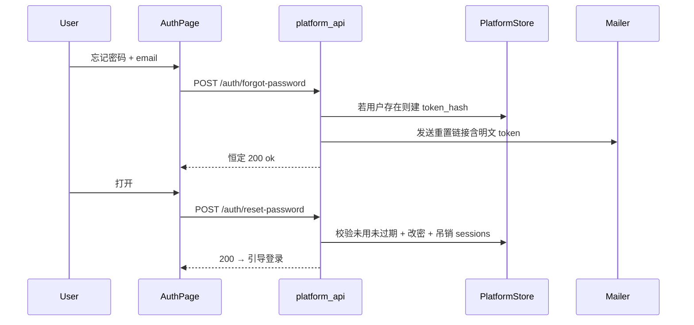

# 忘记密码邮件流

## 背景

平台已有登录态改密（[`change_password`](platform_api/routers/auth.py) / Settings），**没有**自助重置、token 表或出站邮件。上游 Hermes Email 适配器不复用。落点仅限 `platform_api/`、`gateway/web/platform/`、`web-chat/`、`tests/platform/`（Strategy 2）。

## 流程



## 已定设计

| 项 | 决策 |
|----|------|
| 防枚举 | `forgot-password` 对未知/禁用邮箱也返回 `{status:"ok"}` |
| Token | 明文仅入邮件；库内存 SHA-256；TTL **1h**；单次使用 |
| 改密后 | 吊销该用户全部 `platform_sessions` |
| 邮件 | 可注入 `Mailer`；配置了 `PLATFORM_SMTP_*` 走 SMTP；未配置时 `ConsoleMailer` 打 WARNING（含链接，便于本地/演练） |
| 限流 | 复用滑动窗口：按 email + IP，默认 5 次 / 300s（与登录同量级） |
| 前端 | AuthPage 子模式 `forgot` / `reset`；路由 `#/reset-password` |

## 后端

### 模型

[`gateway/web/platform/models.py`](gateway/web/platform/models.py) 新增：

```python
class PasswordResetToken(Base):
    __tablename__ = "password_reset_tokens"
    token_hash: str  # PK, sha256 hex
    user_id: str     # FK users
    expires_at: datetime
    used_at: Optional[datetime]
    created_at: datetime
```

启动时现有 [`create_all` + `migrate_schema`](gateway/web/platform/database.py) 会建新表；不必强制写 Alembic（`001_initial` 已是 `create_all`）。

### Store

[`gateway/web/platform/store.py`](gateway/web/platform/store.py)：

- `request_password_reset(email) -> Optional[str]`：用户存在且未禁用时生成 token、失效旧未用 token、返回明文；否则 `None`
- `reset_password_with_token(token, new_password)`：校验 → `hash_password` → 标 `used_at` → 删除该用户 sessions；非法/过期 → `InvalidCredentialsError`

### Mail + Config

- 新 [`platform_api/services/mail.py`](platform_api/services/mail.py)：`Mailer` 协议 + `SmtpMailer` + `ConsoleMailer` + `get_mailer()`
- [`platform_api/config.py`](platform_api/config.py) 增加：`PLATFORM_PUBLIC_BASE_URL`、`PLATFORM_SMTP_HOST/PORT/USER/PASSWORD`、`PLATFORM_MAIL_FROM`、`PLATFORM_RESET_TOKEN_TTL_SECONDS`（默认 3600）
- 重置链接：`{PUBLIC_BASE_URL}/#/reset-password?token={token}`（缺省 base 用 `http://127.0.0.1:8643`）

### API

[`platform_api/routers/auth.py`](platform_api/routers/auth.py)：

- `POST /api/v1/auth/forgot-password` `{email}` → 恒定 ok；写 audit `auth.forgot_password`（不记是否命中用户）
- `POST /api/v1/auth/reset-password` `{token, new_password}`（`min_length=8`）→ ok / 400

### 文档

[`docs/user-guide/DEPLOY.md`](docs/user-guide/DEPLOY.md) 补 SMTP / `PLATFORM_PUBLIC_BASE_URL` 小节；[`TODOLIST.md`](TODOLIST.md) 勾选 Post-MVP「忘记密码邮件流」。

## 前端

- [`web-chat/src/routing.ts`](web-chat/src/routing.ts)：路由 `reset-password`；`parseRoute` 支持 `#/reset-password?token=`
- [`web-chat/src/App.tsx`](web-chat/src/App.tsx)：未登录时该路由仍进 `AuthPage`（带初始 mode/token）
- [`web-chat/src/pages/AuthPage.tsx`](web-chat/src/pages/AuthPage.tsx)：登录表单「忘记密码」→ forgot 表单；reset 表单提交后回 login
- [`web-chat/src/platformClient.ts`](web-chat/src/platformClient.ts)：`forgotPassword` / `resetPassword`
- i18n：`auth.forgot*` / `auth.reset*`

## 测试优先（先红后绿）

新建 [`tests/platform/test_auth_password_reset.py`](tests/platform/test_auth_password_reset.py)：

1. 未知邮箱仍 200，且 mailer **不**发送（或发送次数为 0）
2. 已知邮箱 200，mailer 收到含 token 的链接
3. 合法 token 可改密；旧密码失败、新密码可登录
4. token 复用 / 过期 → 400
5. 改密后旧 session cookie 失效（`/auth/me` 401）
6. forgot 限流触发 429

前端：`AuthPage.test.tsx` 补 forgot 提交与 reset 表单 happy path（mock `platform`）。

Mailer 在测试中通过 monkeypatch `get_mailer` 注入 recording fake。

## 不在范围

- 注册邮件验证
- 与 Hermes Email 网关耦合
- Redis 分布式限流（仍进程内）
