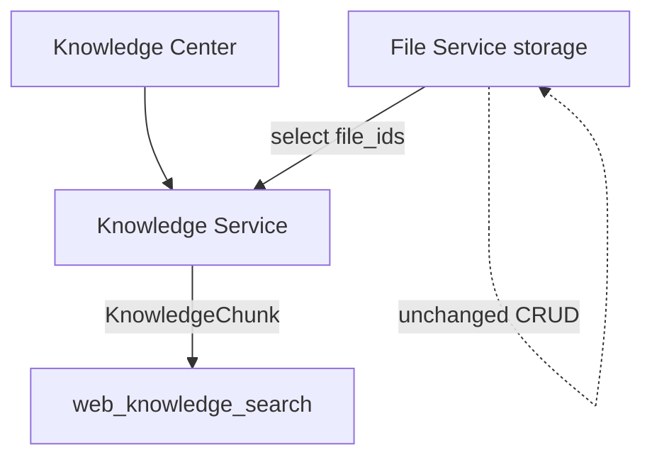

# Knowledge Center MVP 实施计划

## 一、现状结论

| 维度 | 现状 |
|------|------|
| 前端 | React 19 + shadcn；[`FilesPage`](web-chat/src/pages/FilesPage.tsx) 有上传/ingest/试搜；**无** `#/knowledge` |
| 后端 | FastAPI；[`files.py`](platform_api/routers/files.py) 含 `POST .../knowledge/search` |
| 数据 | [`FileRecord`](gateway/web/platform/models.py) + [`DocumentChunk`](gateway/web/platform/models.py)（知识绑在文件上；删文件级联删 chunk） |
| 管道 | [`extract`](platform_api/services/extract.py) → [`chunking`](platform_api/services/chunking.py) → [`ingest`](platform_api/services/ingest.py) / [`knowledge`](platform_api/services/knowledge.py)（关键词检索 MVP） |
| Agent | [`web_knowledge_search`](gateway/web/tools/sandboxed_knowledge_search.py) 搜 **默认 workspace 全部 DocumentChunk** |
| 认证隔离 | Cookie `hermes_session` + `workspace.owner_id` |

**缺口：** 无独立 Knowledge 实体；无法「删知识保留 File」；无真正 reindex；无 Knowledge Center UI。

**原则：** 新增模块，不重构 User/File/Memory/Skill/Agent 核心；复用解析切分管道。

---

## 二、架构方案（锁定）

### 分层

| 层 | 职责 |
|----|------|
| **File Service**（现有） | 上传、存储、文件夹/标签；**不**承载知识生命周期 |
| **Knowledge Service**（新建） | 从 File 建库、解析/切分/索引、状态、检索、删库 |
| **Agent Retriever** | 仅调用 Knowledge Service；按 `user_id`/`workspace_id` 隔离 |

### 与现有 DocumentChunk 关系

- **新表** `knowledge_bases` / `knowledge_files` / `knowledge_chunks` 为 Knowledge Center 真源。
- **保留** `DocumentChunk` + Files 页现有 ingest/试搜，避免破坏 Files 行为（后续可迁移/废弃，非本 MVP）。
- Agent `web_knowledge_search` **改为**检索 `knowledge_chunks`（有库则搜 Knowledge；无库返回空结果提示创建知识库）。不改 `run_agent.py`。

### 状态机（知识库级）

`processing` → `ready` | `failed`（MVP 同步处理：创建时置 `processing`，管道结束后更新）。

---

## 三、数据库设计

Alembic `003_knowledge_center.py` + ORM（[`models.py`](gateway/web/platform/models.py)）：

**`knowledge_bases`**

- `id`, `tenant_id`, `workspace_id`, `user_id`
- `name`, `description`, `category`（`trading`/`tech`/`learning`/`other`）
- `status`（`processing`/`ready`/`failed`）
- `error_message` nullable
- `created_at`, `updated_at`
- 索引：`(workspace_id, status)`, `(user_id, updated_at)`

**`knowledge_files`**

- `id`, `knowledge_id` FK CASCADE, `file_id` FK（**ON DELETE CASCADE 仅关联行**，不删 File 本体——注意：File 删除时删关联；Knowledge 删除时 CASCADE 本表）
- `created_at`
- Unique `(knowledge_id, file_id)`

**`knowledge_chunks`**

- `id`, `tenant_id`, `workspace_id`, `user_id`, `knowledge_id` FK CASCADE
- `file_id` nullable（来源追溯）
- `chunk_index`, `content`, `metadata_json`, `embedding_json`（预留向量；检索 MVP 仍用关键词重叠）
- `created_at`
- 索引：`(knowledge_id)`, `(workspace_id, user_id)`

隔离：所有查询强制 `workspace_id` + owner 校验；chunk 冗余 `user_id` 便于检索过滤。

---

## 四、API 设计

挂载：`/api/v1/workspaces/{workspace_id}/knowledge-bases`（避免与现有 `.../knowledge/search` 冲突）

| 方法 | 路径 | 行为 |
|------|------|------|
| GET | `/knowledge-bases` | 列表 + 可选 stats 汇总端点 |
| GET | `/knowledge-bases/stats` | 库数 / 文档关联数 / chunk 数 / 最近更新 |
| POST | `/knowledge-bases` | body: `name`, `description?`, `category?`, `file_ids[]` → 建库并同步 ingest |
| GET | `/knowledge-bases/{id}` | 详情：来源文件、chunk 数、状态 |
| DELETE | `/knowledge-bases/{id}` | 删库+chunks+关联；**不删 File** |
| POST | `/knowledge-bases/{id}/reindex` | 清空该库 chunks → 重跑管道 → 更新状态 |
| POST | `/knowledge-bases/search` | `{query, top_k, knowledge_id?}` — Center/试搜/Agent 共用 |

实现：[`platform_api/services/knowledge_center.py`](platform_api/services/knowledge_center.py) + [`platform_api/routers/knowledge.py`](platform_api/routers/knowledge.py)。
审计：`store.audit` 动作前缀 `knowledge.*`。

**File 删除策略（锁定）：** 删 File 时 CASCADE `knowledge_files`；并删除该 `file_id` 对应的 `knowledge_chunks`；若某知识库不再有文件则标 `failed` 或保持 `ready` 但空内容——MVP：**有剩余文件则自动标 `processing` 并异步/同步 reindex 剩余**（同步 reindex 剩余文件以简单为准）。

---

## 五、前端（Knowledge Center）

| 项 | 做法 |
|----|------|
| 路由 | `#/knowledge`；[`routing.ts`](web-chat/src/routing.ts) + [`WorkspaceShell`](web-chat/src/components/WorkspaceShell.tsx)：Files → **Knowledge** → Skills → Memory |
| 页面 | 新 [`KnowledgePage.tsx`](web-chat/src/pages/KnowledgePage.tsx)（对齐 Memory/Skill Center） |
| Tabs | 我的知识库 / 创建 /（详情用 Dialog） |
| Client | [`platformClient.ts`](web-chat/src/platformClient.ts) 增 CRUD/stats/reindex/search |
| i18n | `nav.knowledge` = 知识库 / Knowledge Center |
| 测试 | `KnowledgePage.test.tsx` + `tests/platform/test_knowledge_center.py`（CRUD、隔离、删库保留 File） |

创建流：拉取 `listFiles` → 多选 → 填名称/描述/分类 → POST。

---

## 六、Agent 集成（不改核心）

- 改 [`sandboxed_knowledge_search.py`](gateway/web/tools/sandboxed_knowledge_search.py)：调用 `knowledge_center.search(...)`，过滤当前用户 workspace 的 `knowledge_chunks`（`status=ready` 的库）。
- 工具描述注明「用户 Knowledge Center 已就绪的知识库」。
- 无硬编码进 `run_agent.py` / MemoryManager。

---

## 七、安全验收

1. 跨用户 GET/DELETE/search → 404
2. DELETE knowledge → File 与磁盘仍在
3. DELETE file → 原文件 ingest DocumentChunk 行为不变；Knowledge 关联与对应 chunks 清理
4. AuditLog：`knowledge.create` / `delete` / `reindex`

---

## 八、文件修改列表

**新增**

- `platform_api/services/knowledge_center.py`
- `platform_api/routers/knowledge.py`
- `platform_api/migrations/versions/003_knowledge_center.py`
- `web-chat/src/pages/KnowledgePage.tsx` (+ test)
- `tests/platform/test_knowledge_center.py`

**修改**

- [`gateway/web/platform/models.py`](gateway/web/platform/models.py)
- [`platform_api/main.py`](platform_api/main.py) — include router
- [`platform_api/routers/files.py`](platform_api/routers/files.py) — delete file 时清理 knowledge 关联/chunks（或 DB FK 处理）
- [`sandboxed_knowledge_search.py`](gateway/web/tools/sandboxed_knowledge_search.py)
- [`web-chat` routing / App / WorkspaceShell / platformClient / i18n / styles]
- [`TODOLIST.md`](TODOLIST.md)、[`web-chat/README.md`](web-chat/README.md)

**不碰**

- `run_agent.py`、`MemoryManager`、Memory/Skill Center 业务逻辑

---

## 九、MVP 明确不做

- Redis Worker / 真 pgvector cosine
- 自动知识整理、多 Agent 共享
- 从 File 自动建库（须用户在 Center 显式创建）
- 替换/删除 DocumentChunk 管道

---

## 十、实施节奏

1. **PR1**：模型 + migration + Knowledge Service + API + 隔离/CRUD/删库保留 File 测试
2. **PR2**：Knowledge Center UI + 路由 Tab + Vitest
3. **PR3**：Agent `web_knowledge_search` 切 KnowledgeChunk + 文档（TODOLIST/README）

确认后从 **PR1 测试先行** 开始实现。
