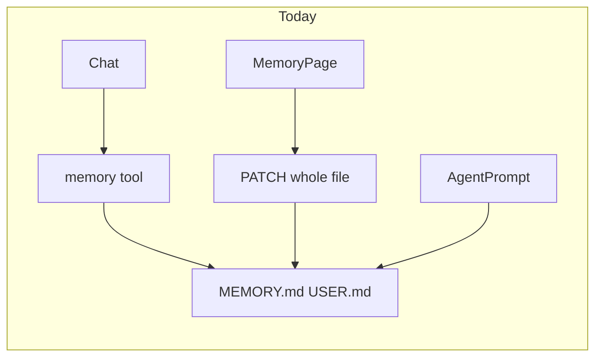
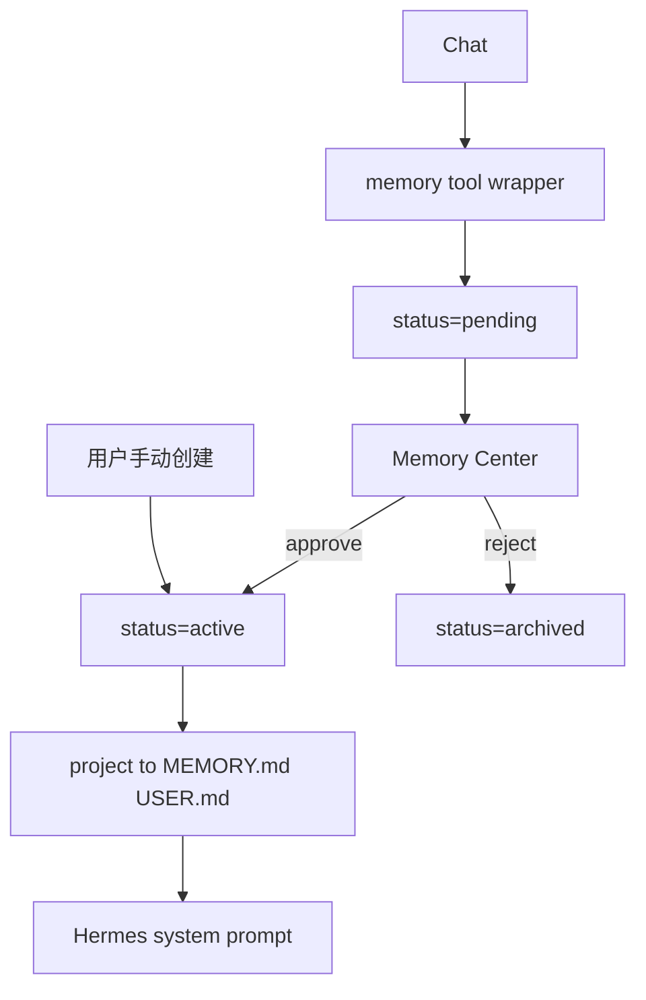

# Memory Center MVP 实施计划

## 一、现状分析（已完成调研）

| 维度 | 现状 |
|------|------|
| 前端 | React 19 + Vite + shadcn/Radix + Tailwind v4；手写 hash 路由；[`MemoryPage.tsx`](web-chat/src/pages/MemoryPage.tsx) 已在 `#/memory` |
| 后端 | FastAPI [`platform_api/`](platform_api/)；Gateway [`gateway/web/`](gateway/web/) + [`web_chat.py`](gateway/platforms/web_chat.py) |
| 数据库 | SQLAlchemy（PG/SQLite via `PLATFORM_DATABASE_URL`）；记忆**不在 DB**，在沙箱文件 |
| 认证 | Cookie `hermes_session` → `get_current_user_id`；workspace `owner_id` 校验 |
| Agent 记忆 | `MemoryStore` 读 `memories/MEMORY.md` + `USER.md`（`§` 分隔）；`memory` 工具即时落盘；**无 pending** |
| 隔离 | `enter_user_context` + `HERMES_HOME` ContextVar（**不改** `agent/memory_manager.py`） |

现有 API 仅整文件：

- `GET/PATCH /api/v1/workspaces/{id}/memory` → `{long_term, profile}`

产品缺口：无条目 id / category / status / 来源追踪 / 审核流。

---

## 二、MVP 范围（锁定，非全量重写）

**本阶段做：**

1. Platform DB 结构化 `memory_items` + 独立 Memory Service
2. 条目 CRUD + approve / reject API
3. Memory Center 页面（替换现有双编辑器 UX，路由仍为 `#/memory`）
4. Web Agent：`memory` 工具写入 → **仅创建 `pending`**，禁止静默永久保存
5. 用户批准后 → `active`，并**投影**到 `MEMORY.md` / `USER.md` 供 Hermes 提示词读取
6. 一次性迁移：把现有 `§` 条目导入为 `active`（`source=import`）

**本阶段不做（预留扩展点）：**

- 聊天结束后的 LLM Memory Extractor（接口预留，默认关闭）
- 全面废除 md 文件（Agent 仍读投影文件，零改 `MemoryManager`）
- MCP / RAG 向量化记忆（模型预留 `metadata`）

---

## 三、数据模型

新表 `memory_items`（[`gateway/web/platform/models.py`](gateway/web/platform/models.py) + Alembic `002_memory_items.py`）：

| 字段 | 说明 |
|------|------|
| `id` | UUID PK |
| `tenant_id` / `workspace_id` / `user_id` | 多租户隔离 |
| `category` | `profile` \| `preference` \| `project` \| `skill` \| `workflow` \| `knowledge` |
| `content` | 记忆正文 |
| `source` | `conversation` \| `manual` \| `import` \| `agent_tool` |
| `confidence` | 0–1 float |
| `status` | `active` \| `pending` \| `archived` |
| `importance` | 0–100，供排序 |
| `source_ref` | 可选 session_id / message 摘要 |
| `raw_excerpt` | 原始聊天片段（来源追踪） |
| `ai_summary` | AI 总结（可与 content 同） |
| `metadata` | JSON（项目状态、技术栈等） |
| `created_at` / `updated_at` | |

索引：`(workspace_id, status)`、`(workspace_id, category)`、`(user_id, updated_at)`。

**真源：** DB。**投影：** `active` 且 category∈{profile} → `USER.md`；其余 active → `MEMORY.md`（仍用 `§` 拼接，兼容 `MemoryStore`）。

---

## 四、API 设计（对齐现有 workspace 前缀）

用户草案中的 `/api/memory` 映射为 Platform 既有风格（cookie 鉴权 + workspace 归属）：

| 方法 | 路径 | 行为 |
|------|------|------|
| GET | `/api/v1/workspaces/{wid}/memory/items` | 列表：`q` / `category` / `status` / `sort` |
| GET | `/api/v1/workspaces/{wid}/memory/stats` | 总数、pending 数、最近更新 |
| POST | `/api/v1/workspaces/{wid}/memory/items` | 手动创建（默认 `active`+`manual`） |
| PUT | `/api/v1/workspaces/{wid}/memory/items/{id}` | 修改 |
| DELETE | `/api/v1/workspaces/{wid}/memory/items/{id}` | 硬删或 `archived`（MVP：硬删 + 重投影） |
| POST | `.../items/{id}/approve` | pending→active + 重投影 |
| POST | `.../items/{id}/reject` | pending→archived |
| POST | `.../memory/migrate-from-files` | 幂等导入现有 md（首次打开 UI 可调用） |

保留旧 `GET/PATCH .../memory` 作兼容（只读投影 / 高级整文件覆写标为 deprecated），避免立刻打断旧客户端。

实现落点：

- Service：[`platform_api/services/memory_center.py`](platform_api/services/memory_center.py)（CRUD + project + migrate）
- Router：扩展 [`platform_api/routers/memory.py`](platform_api/routers/memory.py) 或拆 `memory_items.py`
- **禁止**把审核逻辑写进 `run_agent.py` / `MemoryManager`

---

## 五、Agent 集成（Strategy 2）

1. 新增 fork 工具模块 [`gateway/web/tools/sandboxed_memory.py`](gateway/web/tools/sandboxed_memory.py)：
   - `web_memory`（或替换注册名）在 web 上下文中：`add` → 写 Platform `pending`；**不**调用 `MemoryStore.add` 永久落盘
   - schema 文案明确告知模型：建议会进待审核队列
2. [`toolsets.py`](toolsets.py) `hermes-web-chat`：用 `web_memory` **替换** `"memory"`（与 skill 沙箱同一模式）
3. 批准后 `project_active_memories(user_id)` 写 md → 下一轮会话 `MemoryStore.load_from_disk` 自动生效
4. Extractor：在 `chat_runner`/`web_chat` **预留** `maybe_enqueue_memory_extraction(session_id)` 空实现 / feature flag，Phase 2 再接 LLM

---

## 六、前端（扩展现有 `#/memory`）

改造 [`MemoryPage.tsx`](web-chat/src/pages/MemoryPage.tsx) → Memory Center（shadcn Tabs，不换路由）：

- 顶栏：标题 + stats（总数 / pending / 最近更新）
- Tab：Profile / Preferences / Projects / Pending / All
- All：搜索 + category 过滤 + 排序（创建/更新/重要程度）
- Pending 卡：保存(=approve) / 修改 / 忽略(=reject)
- 条目卡：content、source、confidence、来源时间、编辑/删除
- [`platformClient.ts`](web-chat/src/platformClient.ts) 增加 items/stats/approve/reject API
- i18n：`nav.memory` 文案可改为「记忆中心」；补 `memoryCenter.*`
- 测试：`MemoryPage.test.tsx` + Vitest；路由不变则 `WorkspaceShell` 改动极小

---

## 七、测试优先（必做）

| 用例 | 位置 |
|------|------|
| CRUD + 跨用户 404 | `tests/platform/test_memory_center.py` |
| approve 后投影文件可被 `MemoryStore` 读到 | 同文件 + sandbox context |
| reject 不进投影 | 同上 |
| agent wrapper 只建 pending | `tests/gateway/test_web_sandboxed_memory.py` |
| 隔离（A 不可见 B） | 扩 `test_isolation_extended.py` |
| UI：pending 操作与列表过滤 | `web-chat/src/pages/MemoryPage.test.tsx` |

一律 `scripts/run_tests.sh` / `cd web-chat && npm test`。

---

## 八、文件修改列表（MVP）

**新增**

- `platform_api/services/memory_center.py`
- `platform_api/migrations/versions/002_memory_items.py`
- `gateway/web/tools/sandboxed_memory.py`
- `tests/platform/test_memory_center.py`
- `tests/gateway/test_web_sandboxed_memory.py`

**修改**

- [`gateway/web/platform/models.py`](gateway/web/platform/models.py) — `MemoryItem`
- [`platform_api/routers/memory.py`](platform_api/routers/memory.py) — items API
- [`toolsets.py`](toolsets.py) — web toolset 换工具
- [`web-chat/src/pages/MemoryPage.tsx`](web-chat/src/pages/MemoryPage.tsx) + `platformClient.ts` + i18n
- [`TODOLIST.md`](TODOLIST.md) — Phase 4.3 Memory Center MVP

**不碰**

- `agent/memory_manager.py`、`run_agent.py`（除已有 user_id 补丁）、`tools/memory_tool.py` 上游实现

---

## 九、风险与缓解

| 风险 | 缓解 |
|------|------|
| Agent 仍用旧 `memory` 工具直写磁盘 | toolset 替换 + 测试锁定 |
| 投影与 DB 不一致 | 所有 mutate 路径统一调 `project_active_memories` |
| 整文件 PATCH 与条目冲突 | 旧 PATCH 标 deprecated；UI 不再暴露；或 PATCH 后触发 re-migrate |
| SQLite/PG 迁移 | Alembic `002`；本地 SQLite 测 + PG CI |
| 提示词体积膨胀 | 投影时尊重现有 char limit；超额按 importance 截断 |
| Extractor 幻觉 | MVP 不做自动抽取；仅 tool→pending |

---

## 十、实施节奏（确认后分 PR）

1. **PR1**：模型 + migration + Memory Service + API + 隔离测试（无 UI / 无 Agent 换工具）
2. **PR2**：Memory Center UI + 迁移按钮/自动 migrate
3. **PR3**：`web_memory` 工具替换 + pending 闭环
4. **后续**：Conversation Memory Extractor（pending only）

确认本计划后，从 **PR1 测试先行** 开始实现。
