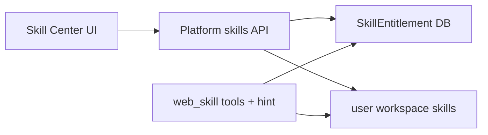

# Skill Center MVP 实施计划

## 一、现状结论（已调研）

| 维度 | 现状 |
|------|------|
| 前端 | React 19 + shadcn；[`SkillsPage.tsx`](web-chat/src/pages/SkillsPage.tsx) 已有 mine/catalog、创建（整份 MD）、启停 Switch、编辑/删除 |
| 后端 | FastAPI [`platform_api/routers/skills.py`](platform_api/routers/skills.py)：`/api/v1/workspaces/{id}/skills*` CRUD + catalog install |
| DB | 仅 [`SkillEntitlement`](gateway/web/platform/models.py)（`enabled` + `config` JSON）；**内容不在 DB** |
| FS | 全局 `$HERMES_HOME/skills/<cat>/<name>/`；用户 `<ws>/skills/<cat>/<name>/SKILL.md` |
| Agent | `hermes-web-chat` 用 `web_skill_*`（[`sandboxed_skill_manage.py`](gateway/web/tools/sandboxed_skill_manage.py)）；hint 注入 enabled 名列表，但文案仍误指 `skill_manage` |

**结论：** MVP 所需的「列表 / 创建 / 编辑 / 删除 / 启停」主干已存在。升级重点是 **产品化 Skill Center UX + 结构化创建 + 列表元数据 + 配置接线 + hint 修复**，不是从零建技能系统。



---

## 二、MVP 范围（锁定）

**本阶段做：**

1. `#/skills` 升级为 **Skill Center**（路由不变，文案/布局对齐 Memory Center）
2. 我的技能列表：名称、描述、版本、状态、更新时间 + 启用/禁用/配置/删除
3. 结构化「创建 Skill」表单 → 服务端生成标准 `SKILL.md`（保留高级「编辑原始 MD」入口）
4. 详情/配置：展示基本信息；编辑 `SkillEntitlement.config`；同步写入技能目录 `config.json`（与 DB 双写，便于未来 Agent/MCP 读取）
5. API：在现有 workspace 前缀下补齐 `enable` / `disable` 便捷端点；列表响应补 `version` / `updated_at` / `status`
6. 修 [`_build_skill_hint`](gateway/platforms/web_chat.py)：指向 `web_skill_view` / `web_skills_list`
7. 隔离与 CRUD 测试补强

**本阶段不做（预留）：**

- 独立 Skill Router / 任务匹配引擎（Agent 核心硬编码）
- 使用日志全量产品化（可后续接 AuditLog / sidecar）
- 高风险权限矩阵 UI（知识库/外网等）—— MVP 仅文档化「默认最小权限 = 现有 web toolset 边界」
- 把内容迁入独立 `skills` 表（继续以 FS + entitlement 为真源，避免双真源）

**API 路径约定：** 产品草案 `/api/skills` 映射为现有风格（与 Memory Center 一致）：

`/api/v1/workspaces/{workspace_id}/skills...`

---

## 三、数据与文件约定

**内容真源（不变）：**

```
web_workspaces/<user_id>/skills/<category>/<name>/
  SKILL.md      # frontmatter: name, description, version, type?
  config.json   # NEW：用户可配参数（与 entitlement.config 同步）
```

**控制面（扩展现有 entitlement）：**

| 字段 | 来源 |
|------|------|
| status | `enabled` → `enabled` / `disabled`（draft = 无磁盘仅 entitlement 时少见，MVP 可不单独建 draft） |
| type | frontmatter `metadata.hermes.type` 或顶层 `type`：`tool`/`workflow`/`analysis`/`assistant`（默认 `assistant`） |
| version | frontmatter `version` |
| updated_at | `SKILL.md` mtime（ISO） |
| config | DB `SkillEntitlement.config` ↔ `config.json` |

**隔离：** 继续 `workspace.owner_id` + `enter_user_context` + `confine_path`；删除仅用户目录，不碰全局库。

---

## 四、后端改动

| 文件 | 改动 |
|------|------|
| [`platform_api/routers/skills.py`](platform_api/routers/skills.py) | `_scan_skills` 增加 `version`/`updated_at`/`type`；`POST .../enable`、`.../disable`；`POST` 支持结构化 body（`description`/`workflow`/`inputs`/`outputs`/`type`）或内部调 builder |
| 新 [`platform_api/services/skill_center.py`](platform_api/services/skill_center.py) | `build_skill_md(...)`；`read/write_config_json`；`sync_entitlement_config`；`set_enabled` |
| [`sandboxed_skill_manage.py`](gateway/web/tools/sandboxed_skill_manage.py) | list/view 元数据带 version；create 可写 `config.json` |
| [`gateway/platforms/web_chat.py`](gateway/platforms/web_chat.py) | 修 skill hint 工具名 |
| 测试 | `tests/platform/test_skill_center.py`：结构化创建、启停、配置双写、跨用户 404 |

结构化创建生成的 `SKILL.md` 骨架（示意）：

```markdown
---
name: futures-analysis
description: 期货分析助手。
version: "1.0"
type: analysis
---
# Futures Analysis

## When to Use
...

## Procedure
1. ...

## Inputs / Outputs
...
```

---

## 五、前端改动

| 文件 | 改动 |
|------|------|
| [`SkillsPage.tsx`](web-chat/src/pages/SkillsPage.tsx) | Skill Center：统计条（可选）+ 表格/卡片列表字段；创建 Dialog 改为结构化字段；配置 Dialog（JSON 或简单 key-value）；保留 catalog tab |
| [`platformClient.ts`](web-chat/src/platformClient.ts) | `SkillRow` 扩字段；`enableSkill`/`disableSkill`；`createSkill` 支持结构化 payload；`patchSkill` 配 config |
| i18n `en.json` / `zh.json` | `nav.skills` → Skill Center / 技能中心；补 `skills.center.*` |
| [`SkillsPage.test.tsx`](web-chat/src/pages/SkillsPage.test.tsx) | 创建结构化表单、启停、配置保存 |
| [`styles.css`](web-chat/src/styles.css) | 轻量 Skill Center 样式（复用 memory-center 模式） |

---

## 六、Agent 集成（MVP）

保持 **独立模块** 现状，不改 `run_agent.py` / `MemoryManager`：

- 加载：`web_skills_list` / `web_skill_view` + chat hint（仅 enabled）
- 创建/改：`web_skill_*` 仍只写用户 workspace
- **Skill Router**：本阶段不实现；后续可作为 `platform_api/services/skill_router.py` 在 gateway 侧按用户消息匹配 skill 名并注入 hint（仍不进 Hermes 核心）

---

## 七、安全（MVP 验收）

1. 列表/详情/删改：非 owner → 404
2. 删除用户 skill 不影响他人与全局库
3. 权限：不新增高风险能力；config 默认 `{}`
4. 审计：对 create / delete / enable / disable / config 写 `AuditLog`（复用现有 admin audit 模式，动作前缀 `skills.*`）

---

## 八、实施节奏

1. **PR1**：`skill_center` service + API 元数据/enable-disable/结构化创建 + 隔离测试
2. **PR2**：Skill Center UI + platformClient + Vitest
3. **PR3**：修 skill hint + 可选 AuditLog

确认后从 **PR1 测试先行** 开始实现。
