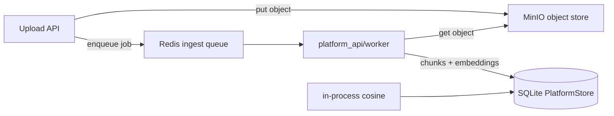
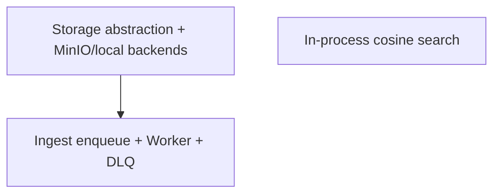

# 不上 PostgreSQL：三项基础设施工作分析

## 约束（已锁定）

- **控制面数据库继续 SQLite**（`PLATFORM_DATABASE_URL=sqlite:///...` 现状）。
- **不做** Postgres / **pgvector** / **ivfflat**（扩展只存在于 PG）。
- 第三项目标改写为：**在已有 `embedding_json` 上做进程内 cosine 检索**（DocumentChunk + KnowledgeChunk），关键词作 fallback；chunk 量很大时接受全表扫描成本（2G / ~50 用户 MVP 可接受）。

---

## 一、现状（与三项相关的触点）

| 环节 | 现状 | 关键代码 |
|------|------|----------|
| 上传落盘 | 写用户 workspace `uploads/` 本地文件；`storage_key` = 相对路径 | [`platform_api/routers/files.py`](platform_api/routers/files.py) L94–128；Gateway [`web_chat.py`](gateway/platforms/web_chat.py) uploads |
| Ingest | **同步** `ingest_file_record`：读盘 → extract → chunk → `store_chunks` → `ready/failed` | [`platform_api/services/ingest.py`](platform_api/services/ingest.py) |
| Knowledge 建库 | Knowledge Center **同步** `_run_index` / `_ingest_file_into_knowledge` | [`platform_api/services/knowledge_center.py`](platform_api/services/knowledge_center.py) |
| 检索 | DocumentChunk / KnowledgeChunk **关键词重叠**；已写 `embedding_json` 但未用于打分 | [`knowledge.py`](platform_api/services/knowledge.py) `search_knowledge`；KC `search_knowledge_chunks` |
| Compose | Redis / MinIO **仅镜像**，业务零引用 | [`deploy/docker-compose.yml`](deploy/docker-compose.yml) |
| 依赖 | `[platform]` extra **无** redis / boto3(minio) 客户端 | [`pyproject.toml`](pyproject.toml) |

---

## 二、Redis 异步 Ingestion Worker — 要完成的工作

### 目标行为

1. 上传（或显式 re-ingest）只把 `FileRecord.status=pending|processing`，**立即返回**。
2. 投递任务到 Redis 队列（建议 list + 简单 JSON payload：`file_id`, `user_id`, `workspace_id`, `attempt`）。
3. 独立进程 `platform_api/worker` 消费 → 复用现有 `extract` / `chunking` / `store_chunks`（或抽公共 `run_ingest(file_id)`）。
4. 成功 → `ready`；失败 → 重试（指数退避，上限 N，如 3）；耗尽 → `failed` + 写入 **死信**（Redis 另一 list 或 SQLite `ingest_jobs` 表）。

### 必做清单

- **队列抽象**（建议 `platform_api/services/queue.py`）：`enqueue_ingest` / `brpop`；env：`REDIS_URL`；无 Redis 时 **fallback 同步 ingest**（保测试/单机开发绿）。
- **Worker 入口**：`platform_api/worker/__main__.py` + `pyproject` console script（如 `hermes-platform-worker`）；循环：取任务 → `enter_user_context` → ingest → ack/retry/DLQ。
- **改调用点**：[`files.py`](platform_api/routers/files.py) 上传循环末尾、`POST .../ingest`；勿在请求线程里跑重管道。
- **Knowledge Center**：建库/reindex 同步管道同样会堵 API——MVP 二选一并锁定：
  - **本阶段锁定**：File ingest 走 Redis；KC 建库仍同步（改动面更小）。
  - KC 异步可作 follow-up（另队列或同队列 `job_type=knowledge_reindex`）。
- **幂等**：Worker 重入时先清该 `file_id` 旧 `DocumentChunk` 再写，避免重复切片。
- **测试**：假 Redis（fakeredis 或内存 stub）+ 同步 fallback 路径；失败重试耗尽进 DLQ；并发两任务不串用户（`enter_user_context`）。
- **运维**：`DEPLOY.md` / `startplatform.sh` 增加 worker 进程；Compose 可选 `worker` service。
- **依赖**：`redis` 客户端钉入 `[platform]` extra（上界策略按仓库依赖规则）。

### 不做（本阶段）

- Celery/RQ 全家桶（2G 机器用轻量自研 loop 即可）。
- 多机分片调度、优先级队列产品化。

### 工作量粗估

约 **1.5–2.5 人日**（含测试与 fallback）。

---

## 三、MinIO 对象存储 — 要完成的工作

### 目标行为

- 上传写 MinIO bucket；DB `storage_key` 改为可解析的对象键（建议：`s3://{bucket}/{user_id|workspace_id}/uploads/{file_id}_{name}` 或统一前缀 `minio:{bucket}/{key}`）。
- 读/删/ingest：经 **Storage 抽象**，不再假设本地 `Path`。
- 无 MinIO 配置时 **fallback 本地 workspace**（现状），开发与 CI 不强制 Compose。

### 必做清单

- **`platform_api/services/object_store.py`**（S3 API）：`put` / `get_to_temp` / `delete` / `exists`；用 `boto3` 或 `minio` SDK 之一（仓库已有 bedrock 用 boto3，优先 boto3 + endpoint_url）。
- **Env**：`MINIO_ENDPOINT`、`MINIO_ACCESS_KEY`、`MINIO_SECRET_KEY`、`MINIO_BUCKET`、`MINIO_SECURE`；启动时 ensure bucket。
- **改上传路径**：[`files.py`](platform_api/routers/files.py) 写对象而非 `dest.write_bytes`；[`file_registry`](platform_api/services/file_registry.py) / content 下载 / delete（现 `unlink_storage_key`）走同一抽象。
- **改 ingest / KC**：从对象拉到临时文件再 `extract_text`，或 stream 到 temp；`confine_path` 仅用于 **local backend**；object key 用独立校验（禁止 `..`、强制前缀含 workspace/user）。
- **Gateway chat 附件**（[`web_chat.py`](gateway/platforms/web_chat.py) uploads）：同一 Storage 抽象，避免「Platform 走 MinIO、Chat 仍本地」双轨。
- **沙箱工具读文件**：若 Agent 通过 `web_file_*` 读上传物，需确认是否仍要求本地镜像——锁定：**ingest/预览从 MinIO 拉；workspace 沙箱文件与上传对象分离**，上传物不默认出现在可写沙箱除非显式桥接（避免大改 Strategy 2）。
- **测试**：moto / fake S3 或 local fallback 单测；删文件同时删对象；错误 key 不越权。
- **依赖 + Compose**：文档说明 `docker compose up redis minio`；健康检查可选。

### 工作量粗估

约 **2–3.5 人日**（含 chat 上传对齐与隔离测试）。

---

## 四、「pgvector cosine」在不上 PG 时的替代工作

### 不可做

- Postgres 扩展、`vector` 列、`ivfflat` 索引、SQL `ORDER BY embedding <=> query`。

### 改为可做（锁定方案）

**进程内 cosine**：查询时 `embed_text(query)`，加载工作区内 chunk 的 `embedding_json`，算余弦相似度，取 top_k。

| 改动点 | 内容 |
|--------|------|
| [`knowledge.py`](platform_api/services/knowledge.py) `search_knowledge` | 优先 cosine；无向量或维度不齐则回退关键词 |
| [`knowledge_center.py`](platform_api/services/knowledge_center.py) `search_knowledge_chunks` | 同上，且仅 `status=ready` |
| 性能护栏 | 单 workspace 上限扫描（如最多 5k chunk）或按 `knowledge_id` 过滤；超限记日志仍返回部分结果 |
| 测试 | 同义词/换说法至少一条比关键词更优的用例（可用真实 embedding API mock 固定向量） |

### 明确不做

- SQLite 装第三方向量扩展（运维复杂，与「轻量 2G」冲突）。
- 为 cosine 单独上向量库（Chroma/Qdrant）——范围膨胀，本分析不纳入。

### 工作量粗估

约 **0.5–1 人日**（逻辑已有 embedding 写入，主要是检索打分切换 + 测试）。

---

## 五、建议实施顺序（依赖）

1. **先 Storage 抽象（含 local）** — Worker 才能统一「从哪读文件」。
2. **再 Redis Worker** — 上传 enqueue；local/MinIO 都可消费。
3. **并行或最后做 cosine** — 与队列无关，可独立 PR。

---

## 六、风险与 2G 机器注意点

- Redis + MinIO 常驻约再占 **150–350MB**；Worker 与 API 同机时避免大文件并发 ingest。
- SQLite：**Worker 与 API 同时写**需 WAL + 短事务；重试要防锁超时。
- Cosine 全表扫描：用户资料库很大时延迟上升——靠 workspace 过滤与上限，不是 ivfflat。
- Strategy 2：新代码放在 `platform_api/` + `gateway/web/`；不改 `run_agent.py`。

---

## 七、验收标准（完成定义）

1. 上传大文档时 HTTP **秒级返回**，`status` 经 pending→processing→ready；Worker 日志可见；人为失败可重试后进 DLQ/`failed`。
2. 配置 MinIO 后文件不在本地 `uploads/`（或仅有缓存），删文件对象一并消失；无 MinIO 时 CI/本地仍绿。
3. Files 试搜与 Knowledge Center / `web_knowledge_search` 在 mock 向量下走 **cosine 排序**；无 embedding 时仍关键词可用。
4. 全套 `scripts/run_tests.sh tests/platform/` + 相关 Vitest 绿。
5. `TODOLIST.md` / `DEPLOY.md` 写明：SQLite 路径、Redis/MinIO 可选、**无 pgvector**。

---

## 八、总工作量（粗估）

| 项 | 人日 |
|----|------|
| MinIO + Storage 抽象 | 2–3.5 |
| Redis Worker + 重试/死信 | 1.5–2.5 |
| 进程内 cosine | 0.5–1 |
| 文档/脚本/联调 | 0.5–1 |
| **合计** | **约 4.5–8 人日** |

（KC 建库异步、Chat 附件深度桥接沙箱若扩大范围，再 +1–2 人日。）
