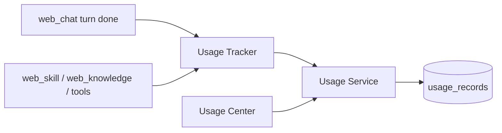

# Usage Center MVP 实施计划

## 一、现状结论

| 维度 | 现状 |
|------|------|
| 本地用量表 | **无** `UsageRecord`；原 `QuotaGate` 已删除 |
| Chat tokens | [`WebChatAgentRunner`](gateway/web/chat_runner.py) 汇总 `input/output/total` → SSE `done.usage` → UI 气泡；**不落库** |
| 上游钱包 | [`platform_api/routers/billing.py`](platform_api/routers/billing.py) 代理 new-api `usage`/`logs` |
| Settings | 用量 Tab 为「开发中」stub；client 仍有 `getBillingUsage` |
| Skill/Knowledge 调用 | 无统一平台侧计数 |

**边界锁定：** Usage Center = **平台活动/成本分析账本**；new-api billing = **上游额度钱包**。二者并存，不互相替换。

---

## 二、架构方案



**原则**

- 独立模块：[`platform_api/services/usage.py`](platform_api/services/usage.py) + [`gateway/web/usage_tracker.py`](gateway/web/usage_tracker.py)
- **禁止**在 Memory/Skill/Knowledge 业务逻辑内散落 SQL
- **禁止**改 `run_agent.py` 主循环；只在 Gateway 边界调用 Tracker
- Agent 核心零业务耦合（Strategy 2）

**统一入口**

```python
# gateway/web/usage_tracker.py
def track(user_id, type, *, model=None, skill_name=None, knowledge_id=None,
          input_tokens=0, output_tokens=0, cost=None, metadata=None, session_id=None)
```

内部 → Usage Service `create_record`（校验、截断 metadata、禁存密钥字段）。

**MVP 挂钩点（最小）**

| 事件 | 位置 | type |
|------|------|------|
| 聊天回合成功 | [`web_chat.py`](gateway/platforms/web_chat.py) `done` 前 | `chat` + `model`（同轮可写 1～2 条，或单条 type=`chat` 带 model/tokens） |
| `web_skill_view` / install 等 | tool handler 末尾调 tracker（薄包装） | `skill` |
| `web_knowledge_search` | 同上 | `knowledge` |
| 其它 web 工具（可选） | tool complete 回调聚合计数 | `tool` |

MVP 优先保证 **chat/model 落库 + 查询 API + UI**；skill/knowledge/tool 挂钩至少各 1 个代表工具，避免全工具集改动。

**费用：** MVP `cost` 默认 `0` 或按简单 `pricing.yaml`/常量表估算（可配置单价，缺省为 0）；不接支付。

---

## 三、数据库设计

表 `usage_records`（Alembic `004_usage_records.py`）：

| 字段 | 说明 |
|------|------|
| `id` | UUID |
| `tenant_id`, `workspace_id`, `user_id` | 隔离（查询强制 user_id） |
| `type` | `chat` \| `model` \| `skill` \| `knowledge` \| `tool` |
| `model` | 可选模型名 |
| `skill_name` | 可选（不用 skill_id 绑 FS 名，避免无 DB skill PK） |
| `knowledge_id` | 可选 FK 软引用（无则 null） |
| `tool_name` | 可选 |
| `session_id` | 可选 |
| `input_tokens`, `output_tokens`, `total_tokens` | int |
| `cost` | Numeric/Float，默认 0 |
| `metadata_json` | 截断后 JSON；禁止 `api_key`/`authorization`/`password` |
| `created_at` | 索引 `(user_id, created_at)` |

删除用户：预留 `DELETE WHERE user_id=?`（GDPR）；MVP 可在 admin 删除用户路径后续接。

---

## 四、API 设计

前缀：`/api/v1/usage`（当前登录用户；cookie 鉴权）

| 方法 | 路径 | 行为 |
|------|------|------|
| GET | `/summary` | 今日/本月：requests、tokens、cost |
| GET | `/trend?days=7\|30` | 按日聚合 requests/tokens |
| GET | `/by-model` | 模型维度调用/tokens/cost |
| GET | `/by-skill` | skill 调用次数、最近时间 |
| GET | `/logs?limit&offset&type=` | 明细分页 |
| POST | `/record` | **仅内部/同进程 Tracker 使用**；对外可要求 admin 或禁用公开（MVP：仅服务端调用，不暴露给 SPA，或 403 非服务角色） |

实现：[`platform_api/routers/usage.py`](platform_api/routers/usage.py)。
隔离：所有查询 `user_id == get_current_user_id()`。

保留现有 `/billing/*` 不变。

---

## 五、前端 Usage Center

| 项 | 做法 |
|----|------|
| 路由 | `#/usage`；可从 Settings 用量 Tab 链入，或 AccountMenu / Workspace 旁入口 |
| 页面 | [`UsagePage.tsx`](web-chat/src/pages/UsagePage.tsx) |
| 顶栏卡片 | 今日 / 本月：请求、Token、费用 |
| Tab | 概览（简易日趋势表/条）、模型、Skill、详细日志 |
| Client | `platform.getUsageSummary/Trend/ByModel/BySkill/Logs` |
| i18n | `nav.usage` / `usage.*` |
| 测试 | Vitest + `tests/platform/test_usage_center.py`（写入隔离、summary） |

图表 MVP：用现有表格/进度条即可，不强依赖新 chart 库。

---

## 六、安全

1. metadata 白名单/剥离密钥键；字符串字段 max length（如 2KB）
2. SPA 不能伪造任意他人 `user_id`
3. 日志不写 message 全文（可写 `session_id` + token 数）
4. 跨用户 logs → 404/空

---

## 七、文件修改列表

**新增**

- `gateway/web/platform/models.py` — `UsageRecord`
- `platform_api/migrations/versions/004_usage_records.py`
- `platform_api/services/usage.py`
- `platform_api/routers/usage.py`
- `gateway/web/usage_tracker.py`
- `web-chat/src/pages/UsagePage.tsx` (+ test)
- `tests/platform/test_usage_center.py`

**修改**

- [`platform_api/main.py`](platform_api/main.py) — mount router
- [`gateway/platforms/web_chat.py`](gateway/platforms/web_chat.py) — turn done → tracker
- [`sandboxed_knowledge_search.py`](gateway/web/tools/sandboxed_knowledge_search.py) / skill 代表工具 — 成功路径 tracker
- [`web-chat` routing / App / platformClient / i18n]；Settings 用量 Tab 链到 Usage Center
- [`TODOLIST.md`](TODOLIST.md)、[`web-chat/README.md`](web-chat/README.md)

**不碰**

- `run_agent.py`、MemoryManager、计费支付/配额硬限制

---

## 八、MVP 不做

- 收费、套餐、硬配额拦截、企业多租户报表
- 替换 new-api billing
- 全量工具自动埋点框架（后续可 registry middleware）

---

## 九、实施节奏

1. **PR1**：UsageRecord + Service + summary/trend/logs API + 隔离测试 + chat turn 写入
2. **PR2**：Usage Center UI + Settings 入口
3. **PR3**：skill/knowledge 代表工具埋点 + 文档

确认后再编码。
