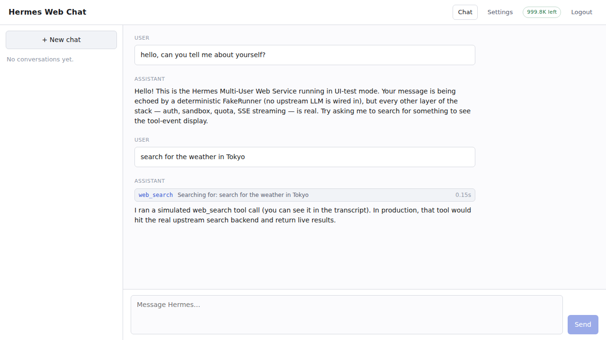

<p align="center">
  <b><a href="README.md">English</a></b> · <a href="README.zh-CN.md">中文</a>
</p>

<p align="center">
  <a href="LICENSE"></a>
  <a href="https://github.com/NousResearch/hermes-agent"></a>
  <a href="https://github.com/QuantumNous/new-api"></a>
</p>

# Hermes Multi-User Web Service

**A self-hosted, multi-tenant chat UI built on top of [Nous Research's Hermes Agent](https://github.com/NousResearch/hermes-agent), with authentication and billing delegated to an upstream OpenAI-compatible gateway like [new-api](https://github.com/QuantumNous/new-api).** End-users paste the API key their administrator issued from the upstream gateway; the browser cookie that comes back carries that key encrypted at rest, and every LLM call is billed to the key's account upstream. One Python process serves any number of users with isolated conversations, memory, and filesystem workspaces.

This is a **fork** of upstream Hermes, not a re-implementation. The agent loop, skill system, memory provider stack, model-provider plugins, and 25+ gateway adapters all come directly from upstream — untouched. What we add is one new platform adapter (`web_chat`), the per-user isolation primitives that go with it, and the thin glue layer that talks to a new-api-compatible upstream — all packaged so `git pull upstream main` stays merge-conflict-free in perpetuity.

```
┌──────────────────────────────────────────────────────────────────┐
│  Browser SPA  ──cookie (hermes_session)──▶  gateway:8643         │
│                                                  │               │
│                       ┌──────────────────────────┘               │
│                       ▼                                          │
│   auth: cookie → user_id + decrypted upstream key                │
│   binding: enter_user_context(user_id), enter_upstream_key(key)  │
│                       │                                          │
│                       ▼                                          │
│   AIAgent (upstream Hermes) inside loop.run_in_executor          │
│         │                                                        │
│         ├─ tools: web_search, memory, todo, skills, web_file_*   │
│         │                                                        │
│         ▼                                                        │
│   new-api gateway ──Bearer (user's key)──▶ OpenAI / Anthropic /  │
│   (handles billing, rate limits, key management)   any LLM       │
└──────────────────────────────────────────────────────────────────┘
```

`new-api` is the example we test against, but any OpenAI-compatible billing gateway that speaks `GET /v1/models` for key validation and `POST /v1/chat/completions` for inference works — One API, Helicone, LiteLLM proxy, your own internal gateway, etc.

---

## Why this split?

Building yet another user-management + token-counting + Stripe-integration stack on top of every chat front-end is wasted engineering. new-api (and its ecosystem) already does all of that better than a hobby project ever will. So this fork's job narrows:

**Hermes provides** the agent loop, tools, skills, memory, and SSE-streaming chat surface.
**new-api provides** user accounts, API keys, per-key metering, billing, model routing, rate limits.
**This fork** is the bridge — a multi-user chat front-end whose users authenticate with new-api keys and whose LLM calls route through new-api.

Concretely, what the fork still does itself:

- **Per-user conversation history** (Hermes session DB filtered on `user_id`)
- **Per-user memory** (`MEMORY.md`, `USER.md`, every provider's cache — all isolated by workspace)
- **Per-user filesystem workspaces** at `$HERMES_HOME/web_workspaces/<user_id>/`
- **Sandboxed file tools** (`web_file_*`) that mirror upstream `read_file` / `write_file` / `patch` / `search_files` but reject any path that escapes the user's workspace
- A new gateway **HTTP adapter** (`gateway/platforms/web_chat.py`) on port 8643 with cookie auth and SSE streaming
- A minimal **React SPA** (`web-chat/`) — 65 KB gzipped JS, no UI framework, no router library
- **Encrypted-at-rest key storage** (Fernet under a server-side master key) so a paste of the key at first login is enough — no need to re-enter it on every browser restart

And what the fork no longer does, because it was redundant with what new-api ships:

- ❌ No email/password registration. There's no register endpoint.
- ❌ No API-key minting. Keys come from new-api's admin panel; this gateway only validates them.
- ❌ No local quota. Billing and limits live upstream.
- ❌ No `argon2-cffi` dependency. Password hashing has nothing to hash.

The user_id that anchors workspaces is **derived** from `sha256(api_key)[:12]` — deterministic, one-way, so the same key in any browser on any machine lands the user in the same conversation history. No central user table needed; new-api is the only source of identity.

---

<a id="screenshots"></a>
## Screenshots

> ⚠️ The screenshots below predate the new-api integration and still show the now-removed email-register flow and per-user quota panel. The current login is a single API-key paste modal that pops up the first time a user hits Send. Updated screenshots are on the roadmap; the streaming-chat screenshot is still representative.

<table>
  <tr>
    <td width="100%" valign="top">
      <a href="assets/screenshots/03-chat-streaming.png"></a>
      <p><sub><b>Streaming chat with tool events.</b> SSE token frames render incrementally; tool calls (<code>web_search</code> shown here) get an inline row with preview + duration. In the current build the header quota badge is gone — billing happens in new-api now.</sub></p>
    </td>
  </tr>
</table>

---

## Upstream compatibility — the core design decision

This is the single most important thing about the project. We hold to a strict rule:

> **Pay code duplication and verbosity if it means upstream files don't get touched.**

The forks that die are the ones that quietly rewrite half of upstream and then can't merge anything for six months. We refuse to be one of those. Concretely:

| Strategy | Where we use it | Why it works |
|---|---|---|
| **Sub-package isolation** | All multi-tenant code lives under `gateway/web/` (new directory), `gateway/platforms/web_chat.py` (new file), and `web-chat/` (new directory). | These paths don't exist upstream, so `git pull` never touches them. Conflict probability: 0. |
| **Mirror, not refactor** | `WebChatAgentRunner` (`gateway/web/chat_runner.py`) is a ~150-LOC parallel to `gateway/platforms/api_server.py`'s `_create_agent` / `_run_agent`. We don't refactor api_server.py to share code with us. | api_server.py is the most-edited gateway file upstream. Any shared module would be a permanent merge-conflict source. The duplication is paid once. |
| **Wrap, not fork** | `web_file_read` / `web_file_write` / `web_file_patch` / `web_file_search` call the upstream `read_file_tool` / `write_file_tool` / etc. via their public function signatures, prefixed by a `confine_path` check. We don't fork `tools/file_operations.py` (~2k LOC) or `tools/file_tools.py`. | Upstream is free to refactor tool internals. Only the public function names matter to us, and those have been stable for many releases. |
| **Surgical bug-fixes** in upstream files | A handful of small B-class edits: `run_agent.py:517` and `agent/conversation_compression.py:391` (1 line each — propagate `user_id` to SessionDB writes); `gateway/run.py` (one `elif Platform.WEB_CHAT` branch in `_create_adapter` + one `NEW_API_BASE_URL` override block in `_resolve_runtime_agent_kwargs`); `hermes_state.py` query-method `user_id` parameter additions; `hermes_cli/config.py` `OPTIONAL_ENV_VARS` entry for `NEW_API_BASE_URL`. All are pure bug fixes or additive parameters; default behavior unchanged. | The user_id propagation is a real multi-tenant bug — slated to be offered back upstream as a PR. The NEW_API_BASE_URL block is a small operational hook. Conflict points resolve in seconds. |
| **Opt-in extra** | `cryptography` is in `[web-chat]` extras, not core. Installs without the extra fail loudly at adapter startup with a clear pip hint. | Doesn't bloat the upstream base install for users who never run the web service. |

**Files we deliberately did not touch**, even when it would have been simpler:

```
gateway/platforms/api_server.py    0 lines changed
tools/file_operations.py           0 lines changed
tools/file_tools.py                0 lines changed
tools/terminal_tool.py             0 lines changed
agent/memory_manager.py            0 lines changed
cli.py                             0 lines changed
hermes_cli/main.py                 0 lines changed
```

Memory isolation is achieved without touching `memory_manager.py` by overriding `HERMES_HOME` via a ContextVar — every memory provider already reads `get_hermes_home()`, so the override propagates everywhere automatically. The per-request upstream-key injection uses the same ContextVar trick for `api_key`.

Maintenance loop: `git fetch upstream && git rebase upstream/main`. Conflicts, when they happen, are confined to the few named patches.

---

## Is this fork for you?

| Use case | Fit |
|---|---|
| **Self-host a chat UI for a small team / community / family**, with new-api (or similar) handling identity and billing | ✅ Core use case — this *is* the project |
| **Already running new-api / One API / LiteLLM** and want a richer chat front-end than the bundled one (real tools, memory, skills) | ✅ Drop-in — point `NEW_API_BASE_URL` at your gateway, paste users' existing keys |
| **Replace OpenAI / Claude / etc. as "personal AI for N people"** where each person has their own usage budget | ✅ Designed for this — new-api meters per-key, this UI surfaces that to a browser |
| **Run an internal tool inside a company** behind a reverse proxy with SSO at the proxy layer | ✅ Combine with TLS + SSO upstream; the cookie just gates the chat surface |
| **Lab / study group / classroom** with per-user history, memory, and (via new-api) usage caps | ✅ The isolation layer is real; let new-api enforce caps |
| **A SaaS product with paid plans** | ⚠️ new-api already handles billing, but you'll still add the marketing / Stripe-checkout / signup-flow front-end yourself |
| **Single-person CLI / local development tool** | ❌ Use upstream Hermes directly. `hermes` and `hermes dashboard` give you that without the multi-tenant overhead |
| **OpenAI-compatible API for external apps** (Open WebUI, LibreChat, OpenAI SDKs) | ❌ Point them at your new-api gateway directly. Or use upstream Hermes's `api_server` platform for non-OpenAI surface area |
| **Untrusted users running arbitrary terminal commands** | ❌ Wrong tool — see "Security model". The web sandbox defends against accidental path traversal, not kernel exploits |

---

## Hardware sizing

Numbers assume the upstream LLM is **cloud-hosted** (routed through new-api → OpenAI / Anthropic / Nous Portal / OpenRouter / your own provider). The bottleneck shifts depending on box size:

| Tier | RAM | CPU | Concurrent active agents | SPA users online | First bottleneck |
|---|---|---|---|---|---|
| **2c / 4 GB** | 4 GB | 2 vCPU | 10–15 | 80–150 | new-api rate limits or upstream LLM |
| **4c / 8 GB** ⭐ | 8 GB | 4 vCPU | 25–40 | 200–300 | new-api / LLM + SQLite > 5 RPS |
| **8c / 16 GB** | 16 GB | 8 vCPU | 60–100 | 500–1000 | SQLite — migrate to Postgres |
| Larger | — | — | — | — | not a single-box deployment — Postgres + Redis + multi-worker |

Disk: ~2 GB for the venv + code, then per-user data grows with use.

**Active** = "in the middle of an agent loop right now". A user reading the assistant's reply or typing the next message is *online* but not active. Typical chat usage has a 1:5 to 1:10 active-to-online ratio.

Practical observations:

- **Concurrent agents are no longer bounded by one shared upstream key**. Each user has their own new-api key with its own quota, so the ceiling is whatever new-api or the underlying provider permits per-key, multiplied by N users.
- **Context compression** in the agent loop is a momentary CPU spike that briefly doubles RSS. Multiple users compressing simultaneously can OOM a 4 GB box if you don't cap concurrency. `WEB_CHAT_MAX_CONCURRENT_AGENTS` (default 12) is the safety valve.
- **SQLite is fine until ~5 RPS sustained**. WAL + jitter retry handles bursts. Above that, migrate to Postgres.

---

## Quick start

```bash
# 1. Clone + base install
git clone https://github.com/SeerBench/hermes-multiuser-web-service.git
cd hermes-multiuser-web-service
./setup-hermes.sh                                 # uv venv + .[all,dev]
source .venv/bin/activate
uv pip install -e ".[web-chat]"                   # adds cryptography (for KeyVault)

# 2. Point at your new-api (or other OpenAI-compatible gateway)
echo "NEW_API_BASE_URL=https://your-new-api.example.com" >> ~/.hermes/.env

# 3. Enable the platform — add to ~/.hermes/config.yaml:
cat >> ~/.hermes/config.yaml <<'YAML'
platforms:
  web_chat:
    enabled: true
    extra:
      host: 127.0.0.1
      port: 8643
      max_concurrent_agents: 12
      cookie_secure: false             # set true in production (HTTPS)
      cookie_ttl_seconds: 604800       # 7 days
YAML

# 4. Build the SPA (one-time, ~50 MB node_modules)
cd web-chat && npm install && npm run build && cd ..

# 5. In your new-api admin panel: create users, mint API keys,
#    hand each key to its intended end-user out-of-band (email, Slack, etc.)

# 6. Run
hermes gateway run
```

Open `http://127.0.0.1:8643/` in a browser. The chat UI is already visible — type a message and hit Send. A modal will pop up asking for the API key. Paste the one the admin gave you. The cookie that comes back is good for 7 days; subsequent visits go straight to chat.

For production deployment: front the gateway with TLS (Caddy / nginx / Traefik), set `cookie_secure: true`, only then change `host: 0.0.0.0` — the adapter **refuses to start** if you skip TLS on a non-loopback bind. Full checklist in [`docs/user-guide/web-chat.md`](docs/user-guide/web-chat.md).

---

## HTTP surface

The single auth mode is the `hermes_session` cookie, issued by `/api/auth/login`.

| Method | Path | Auth | Purpose |
|---|---|---|---|
| `POST` | `/api/auth/login` | none | validate new-api key against upstream + set cookie |
| `POST` | `/api/auth/logout` | cookie | expire cookie + delete server-side row |
| `GET`  | `/api/me` | yes | current `user_id` + first/last-seen timestamps |
| `GET`  | `/api/conversations` | yes | list user's sessions, filtered by `user_id` |
| `POST` | `/api/chat` | yes | **SSE stream** of agent response |
| `GET`  | `/api/healthz` | none | liveness probe |
| `GET`  | `/static/*`, `/assets/*` | none | SPA assets |
| `GET`  | `/` | none | SPA shell |

No `/api/auth/register`, no `/api/keys/*`, no `/api/usage` — those belong to new-api.

### `POST /api/auth/login` validation flow

```
{ "api_key": "sk-..." }
        │
        ▼
GET {NEW_API_BASE_URL}/v1/models     Authorization: Bearer sk-...
        │
        ├─ 2xx                 → derive user_id = "u_" + sha256(key)[:12]
        │                        upsert user row, encrypt key (Fernet), set cookie
        ├─ 401 / 403           → return 401  code=invalid_key
        ├─ other 4xx           → return 502  code=misconfigured
        └─ 5xx / 429 / network → return 503  code=upstream_unreachable
```

### SSE event protocol (`POST /api/chat`)

| event | payload | when |
|---|---|---|
| `token` | `{"text": "..."}` | streaming assistant token |
| `tool_start` | `{"tool": "...", "preview": "..."}` | tool call begins |
| `tool_end` | `{"tool": "...", "duration": 1.2, "error": false}` | tool call returns |
| `reasoning` | `{"text": "..."}` | model reasoning (provider-dependent) |
| `done` | `{"session_id": "...", "usage": {...}}` | terminal frame |
| `error` | `{"message": "...", "code": "..."}` | fatal mid-stream error |

On 401 mid-session (cookie expired or master key rotated) the SPA opens the key prompt again and resends the original message after re-auth.

---

## Multi-browser behavior

Because `user_id = sha256(api_key)[:12]` is deterministic, the same key in any browser maps to the same workspace and conversation history.

| Scenario | Behavior |
|---|---|
| B browser logs in with the same key A used | B's conversation list shows everything A created |
| B reopens a session A started | Full history visible |
| A creates a new session while B has the list open | B needs to refresh to see it (no live push) |
| A and B both open the same session and A sends a message | A streams; B sees the new turn after refresh |
| A and B send to the same session concurrently | SQLite write lock serialises; UI doesn't auto-sync |

Real-time cross-browser push is not implemented in v0.15. Refresh-level sync only.

---

## Security model

**What's isolated by design:**

- **Conversations** — `sessions.user_id` filter on every `list_sessions_rich` / `search_messages` call.
- **Memory** — `enter_user_context` rebinds `HERMES_HOME` via ContextVar; `MemoryManager` and every provider read `get_hermes_home()` and write under `web_workspaces/<user_id>/memories/`. Zero-touch — no agent-internal code modified.
- **Filesystem (tools)** — `web_file_*` route every path through `confine_path` which rejects anything outside the user's workspace. V4A multi-file patches are **refused outright** because their inner file paths can't be inspected without parsing the V4A format.
- **Upstream API key** — encrypted with Fernet under `$HERMES_HOME/web_users_master.key` (chmod 600, auto-generated on first start). Decrypted in memory per request, never logged. Injected into the AIAgent's LLM client via a per-task ContextVar so concurrent requests can't see each other's key.
- **Cookie sessions** — `HttpOnly` + `SameSite=Lax` + optional `Secure`; server-side row in `web_sessions` enables instant revocation (logout invalidates the row, not just the cookie).

**What's NOT isolated** (deliberate scope decisions):

- **OS-level shell.** The default toolset excludes `terminal`, `process`, `code_execution`, `browser_*`, `computer_use`. Don't add them back without an OS-level sandbox (Docker / firejail / chroot). The Python-layer `confine_path` defends against accidental path traversal, not kernel exploits.
- **Kernel exploits.** `confine_path` is a Python-layer guard, not a defense against a compromised CPython or a kernel CVE.
- **Upstream $-cost overruns.** Billing happens at the new-api layer. If you need hard caps, set per-key quotas in new-api's admin panel — this gateway does not duplicate that.

If `~/.hermes/web_users_master.key` is ever compromised, delete it; a fresh key auto-generates on next start. Every existing cookie session is invalidated (their encrypted key payloads no longer decrypt), and users get re-prompted for their new-api key — no data loss, since `user_id` is derivable from the key itself.

---

## Testing & quality

This fork ships with automated tests for every fork-specific module. All passing on `main`:

| Layer | File |
|---|---|
| User-id isolation in SessionDB | `tests/hermes_state/test_user_id_filtering.py` |
| UserStore (user records, web sessions) | `tests/gateway/test_web_users.py` |
| Sandbox + workspace contextvars | `tests/gateway/test_web_sandbox.py` |
| Cookie auth middleware | `tests/gateway/test_web_auth_middleware.py` |
| Chat runner (AIAgent factory + ContextVar key injection) | `tests/gateway/test_web_chat_runner.py` |
| HTTP adapter (login flow, /me, /conversations, chat auth gate) | `tests/gateway/test_web_chat_adapter.py` |
| Sandboxed `web_file_*` tools | `tests/gateway/test_web_sandboxed_file_tools.py` |
| Upstream key validator (new-api `/v1/models` probe) | `tests/gateway/test_web_upstream_validator.py` |
| Upstream key ContextVar + user_id derivation | `tests/gateway/test_web_upstream_key.py` |
| Fernet KeyVault (encrypt / decrypt / master key file) | `tests/gateway/test_web_key_storage.py` |

Run with the project test wrapper (CI-parity hermetic env):

```bash
scripts/run_tests.sh tests/gateway/test_web_*.py tests/hermes_state/test_user_id_filtering.py
```

The most load-bearing test is **`test_concurrent_requests_dont_swap_user_contexts`** — two simultaneous chat requests from different users must each see their own `user_id` and their own upstream API key reaching the runner. This is the test that proves the multi-user contract: ContextVars are asyncio-task-local, not threadlocal, so one user's request can't leak into another's workspace or billing account under concurrent load.

---

## Repository layout

```
.
├── gateway/
│   ├── platforms/web_chat.py        HTTP adapter — cookie auth + routes + SSE
│   └── web/                         ← all multi-tenant code lives here
│       ├── users.py                 UserStore (user records + cookie sessions)
│       ├── auth.py                  cookie middleware + KeyVault wiring
│       ├── sandbox.py               enter_user_context / confine_path
│       ├── upstream_key.py          per-request upstream-key ContextVar + user_id derivation
│       ├── upstream_validator.py    pre-login key probe against new-api /v1/models
│       ├── key_storage.py           KeyVault (Fernet + on-disk master key)
│       ├── chat_runner.py           AIAgent factory (mirror of api_server)
│       └── tools/
│           ├── __init__.py          (side-effect register on import)
│           └── sandboxed_file_operations.py     web_file_* tools
│
├── web-chat/                        ← React SPA → builds to gateway/web/_static/
│   ├── src/
│   │   ├── App.tsx                  hash router + nav, no auth gate
│   │   ├── api.ts                   typed fetch wrappers + SSE async generator
│   │   ├── main.tsx                 React entrypoint
│   │   ├── styles.css               single global stylesheet (dark + light)
│   │   ├── pages/{Chat,Settings}Page.tsx
│   │   └── components/{KeyPromptModal,ConversationList,ToolEvent}.tsx
│   ├── package.json                 react 19 + vite 7 + ts 5
│   └── vite.config.ts               proxies /api → :8643 in dev
│
├── tests/
│   ├── hermes_state/test_user_id_filtering.py
│   └── gateway/test_web_*.py        9 test files covering the fork surface
│
├── docs/user-guide/web-chat.md      operator guide (new-api integration walk-through)
│
└── (everything else from upstream Hermes Agent, untouched)
```

---

## Roadmap

In rough order of useful next steps:

- [ ] **GET /api/conversations/{id}** to load transcript history (SPA can switch sessions but doesn't fetch history yet)
- [ ] **Refreshed screenshots** matching the new-api login flow
- [ ] **Plugin-hook proposal to upstream** — `register_gateway_platform()` on `PluginManager` so this whole fork can be re-published as a standalone plugin and the surgical patches dissolve
- [ ] **Optional Postgres backend** for `web_users.db` when single-box SQLite tops out
- [ ] **OAuth / SSO** at the proxy layer for company deployments (cookie still gates the chat surface)
- [ ] **OS-level per-user sandbox** wired through upstream's existing Docker terminal backend
- [ ] **Push-based multi-browser sync** (per-user SSE event-bus) for users who keep the app open on multiple devices

The user-id propagation fixes are intended to be offered back upstream as a PR — real bugs in the shared `user_id`-column infrastructure, with no behavioral change for existing single-user callers.

---

## Acknowledgements & license

- **Upstream agent**: [Nous Research / hermes-agent](https://github.com/NousResearch/hermes-agent) — the entire agent loop, skill system, memory stack, tool registry, 25+ gateway platforms, model-provider plugins, and CLI come from there. The fork is a thin operational layer on top of that work.
- **Upstream billing gateway**: [new-api](https://github.com/QuantumNous/new-api) — example reference, but any OpenAI-compatible upstream that responds to `GET /v1/models` works (One API, Helicone, LiteLLM proxy, internal gateways, etc.).
- **License**: MIT, matching upstream — see [`LICENSE`](LICENSE).

Further reading:

- [`docs/user-guide/web-chat.md`](docs/user-guide/web-chat.md) — operator-focused guide (setup, HTTP surface, capacity, production checklist, admin tasks).
- [`web-chat/README.md`](web-chat/README.md) — SPA development notes.
- For upstream agent behavior (skills, memory, tools, model routing), see [hermes-agent.nousresearch.com/docs](https://hermes-agent.nousresearch.com/docs/) — everything there applies here too, unmodified.
- [`AGENTS.md`](AGENTS.md) (~1100 lines) is the upstream engineering guide — canonical for anything below the multi-user layer.
- [`CLAUDE.md`](CLAUDE.md) is the orientation file for working in this repo with [Claude Code](https://claude.com/claude-code).
