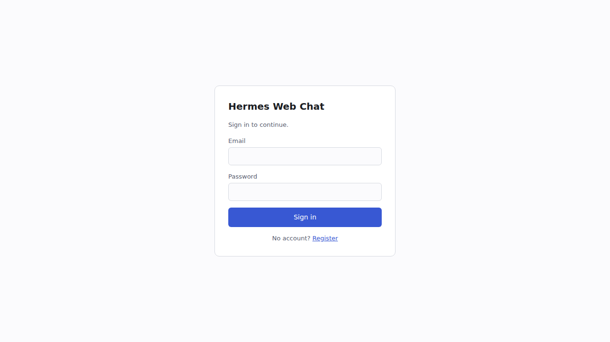
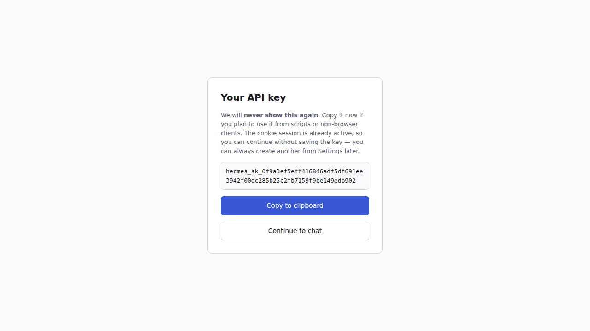
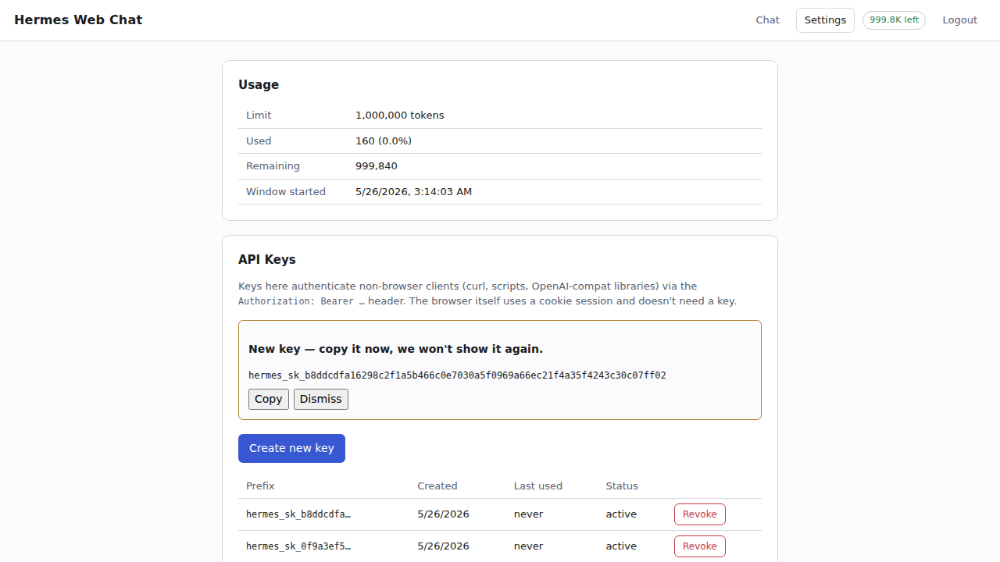

<p align="center">
  <a href="README.md">English</a> · <b><a href="README.zh-CN.md">中文</a></b>
</p>

<p align="center">
  <a href="LICENSE"></a>
  <a href="https://github.com/NousResearch/hermes-agent"></a>
  <a href="#screenshots"></a>
</p>

# Hermes 多用户 Web 服务

**基于 [Nous Research 的 Hermes Agent](https://github.com/NousResearch/hermes-agent) 打造的自托管多租户聊天服务。** 一个 Python 进程为任意数量的用户提供完全隔离的账号、对话、记忆、文件系统工作区,以及按用户独立的 token 配额。浏览器 SPA 通过 Server-Sent Events 实时流式输出。2 核 4 GB 的 VPS 即可起步,线性扩展直到 SQLite 或上游 LLM 速率限制成为瓶颈。

这是 Hermes 上游的一个 **fork**,不是重新实现。Agent 主循环、技能系统、记忆 provider 栈、模型 provider 插件、25+ 个 gateway 适配器,全部直接来自上游,**一行未改**。我们新增的是一个 gateway 平台(`web_chat`)及配套的多租户基础设施,以一种**让 `git pull upstream main` 永久零合并冲突**的方式打包。

```
┌──────────────────────────────────────────────────────────────────┐
│  浏览器 SPA  ──Cookie 或 Bearer──▶  gateway:8643                 │
│                                          │                       │
│                                          ▼                       │
│  每个请求:  auth → user_id → enter_user_context(user_id)        │
│                                          │                       │
│         ┌────────────────────────────────┘                       │
│         ▼                                                        │
│  AIAgent(上游 Hermes)运行于 loop.run_in_executor                │
│         │                                                        │
│         ├─ 工具:web_search、memory、todo、skills、web_file_*    │
│         └─ 上游 LLM(一个共享 key,按用户计量)                  │
└──────────────────────────────────────────────────────────────────┘
```

---

<a id="screenshots"></a>
## 界面截图

整个 UI 是一个自包含的 React SPA —— 66 KB gzipped JS,**不带**框架、**不带** router 库。下面是仓库自带端到端测试的真实截图:真实的 `aiohttp` 服务监听真实 TCP 端口,真实浏览器驱动。

<table>
  <tr>
    <td width="50%" valign="top">
      <a href="assets/screenshots/01-login.png"></a>
      <p><sub><b>登录 / 注册。</b>同一张卡片切换两种模式 —— 点 <i>Register</i> 翻面。根据系统偏好自动 dark/light 切换。</sub></p>
    </td>
    <td width="50%" valign="top">
      <a href="assets/screenshots/02-api-key-reveal.png"></a>
      <p><sub><b>API key 一次性展示。</b>注册时**只显示一次**,带 copy 按钮。服务端只存 <code>sha256(plaintext)</code> —— 忘了 key 没法找回,只能吊销重发。</sub></p>
    </td>
  </tr>
  <tr>
    <td width="50%" valign="top">
      <a href="assets/screenshots/03-chat-streaming.png"></a>
      <p><sub><b>SSE 流式对话 + 工具事件。</b>SSE token 帧 4 字符一组地流出来;工具调用(此处 <code>web_search</code>)inline 显示一行,带 preview + 时长。顶部 badge 显示 <code>999.8K left</code> 配额,每轮对话后实时更新。</sub></p>
    </td>
    <td width="50%" valign="top">
      <a href="assets/screenshots/04-settings.png"></a>
      <p><sub><b>设置页 —— 配额 + API key。</b>实时配额从 <code>web_users.db</code> 拉取;key 列表只显示前缀(从不显示明文),一键吊销。<i>Create new key</i> 弹出一次性明文面板,带 copy / dismiss。</sub></p>
    </td>
  </tr>
</table>

---

## 为什么需要这个 Fork

上游 Hermes Agent 是一个出色的**单用户 CLI** 和**单租户 gateway**。它没有发布多用户 Web 产品 —— 因为这从来不是上游的目标。但 agent 内核(工具、技能、记忆、模型路由、沙箱终端后端)恰好是你想要的"带真实工具的 ChatGPT"基底,适合给小团队、家人、研究小组、社区自托管。所以这个 fork 在此之上加了:

- **按用户的账号系统**(邮箱 + 密码,Argon2id 哈希)和 **API key**(`hermes_sk_...`,sha-256 存储)
- **按用户的对话**(session DB 按 `user_id` 过滤)和**记忆**(`MEMORY.md`、`USER.md`、所有 memory provider 缓存,全部隔离)
- **按用户的文件系统工作区**,位于 `$HERMES_HOME/web_workspaces/<user_id>/`
- **按用户的 token 配额**(30 天滚动窗口,自动重置,可逐用户配置)
- 新的 gateway **HTTP 适配器**(`gateway/platforms/web_chat.py`),端口 8643,Cookie + Bearer 双鉴权,SSE 流式
- 极简的 **React SPA**(`web-chat/`)—— 66 KB gzipped JS,**不引入** UI 框架、router 库、状态管理库
- **沙箱化文件工具**(`web_file_*`),镜像上游 `read_file` / `write_file` / `patch` / `search_files`,但拒绝任何越出用户工作区的路径

其它一切原封不动。如果上游发布新工具、新技能、新 memory provider、新模型 provider,你下次 `git pull upstream main` 就免费拿到。

---

## 上游兼容性 —— 项目最核心的设计决定

这是关于本项目最重要的一件事。我们坚持一条严格的规则:

> **宁可代码冗余、宁可啰嗦,也不动上游文件。**

死掉的 fork 都是一种:悄悄改写了上游一半,然后半年都 merge 不了任何更新。我们拒绝做那种 fork。具体来说:

| 策略 | 用在哪 | 为什么有效 |
|---|---|---|
| **子包隔离** | 所有多租户代码住在新目录 `gateway/web/`、新文件 `gateway/platforms/web_chat.py`、新目录 `web-chat/` 下。 | 这些路径上游不存在,`git pull` 永远不会碰它们。冲突概率:0。 |
| **镜像,不重构** | `WebChatAgentRunner`(`gateway/web/chat_runner.py`)是 `api_server.py` 的 `_create_agent` / `_run_agent` 的~150 行平行实现。我们不把 api_server.py 重构成跟我们共享代码。 | api_server.py 是上游编辑最频繁的 gateway 文件。任何共享模块都会变成永久的合并冲突源。冗余只付一次,合并冲突会反复发生。 |
| **包装,不分叉** | `web_file_read` / `write` / `patch` / `search` 通过上游 `read_file_tool` / `write_file_tool` 等的公共函数签名调用,只在前面加一层 `confine_path` 校验。我们不分叉 `tools/file_operations.py`(~2k LOC)或 `tools/file_tools.py`。 | 上游可以自由重构工具内部。只有公共函数名对我们重要,而它们多个版本以来都没变过。 |
| **上游文件里只做外科手术式的 bug 修复** | 4 处小 B 类改动:`run_agent.py:517` 和 `agent/conversation_compression.py:391`(各 1 行 —— 把 `user_id` 传给 SessionDB 写入);`gateway/run.py:12869`(1 行 —— 让 `/branch` 命令传 `user_id`)和一段 10 行的 `elif Platform.WEB_CHAT` 分支;加上 `hermes_state.py` 两个查询方法的 `user_id` 参数。全部是 bug 修复或追加参数,**默认行为完全不变**。 | 这些其实是真的多租户 bug —— `agent._user_id` 在 init 已经设置,但 `_ensure_db_session` 里硬编码成了 `None`。我们计划作为 PR 推回上游。在那之前,这 4 个冲突点都是秒级可解。 |
| **可选 extra** | `argon2-cffi` 在 `[web-chat]` extra 里,不在 core。安装时不带这个 extra,适配器启动会带着清晰的安装提示拒绝运行。 | 不给从不跑 web 服务的用户增加 base 安装体积。 |

**我们刻意不动的文件**,即便有时绕开会更费力:

```
gateway/platforms/api_server.py    0 行改动
tools/file_operations.py           0 行改动
tools/file_tools.py                0 行改动
tools/terminal_tool.py             0 行改动
agent/memory_manager.py            0 行改动
cli.py                             0 行改动
hermes_cli/main.py                 0 行改动
```

记忆隔离不通过改 `memory_manager.py` 实现 —— 我们通过 ContextVar 重定向 `HERMES_HOME`。所有 memory provider 都已经在读 `get_hermes_home()`,所以重定向自动在每一层生效。

维护循环:`git fetch upstream && git rebase upstream/main`。如果发生冲突,只会落在那 4 个具名 patch 上。

---

## 这个 fork 适合你吗?

| 场景 | 适配度 |
|---|---|
| **给小团队 / 社区 / 家人自托管聊天服务**,要账号隔离、对话隔离、按用户使用统计 | ✅ 核心用例 —— 这**就是**这个项目 |
| **在 5–50 美元 VPS 上替代 OpenAI / Claude 作为"N 个人共用的私有 AI"**,主机方拿一份云 LLM key 付费 | ✅ 专为此设计 —— 单一上游凭证 + 按用户配额计量 |
| **公司内部工具**,反向代理 + 网络层鉴权 + 按用户账号做纵深防御 | ✅ 合适;代理层加 TLS + SSO |
| **实验室 / 学习小组 / 课堂的共享 agent**,要每用户独立历史、记忆、使用上限 | ✅ 配额系统就是按这个需求设计的 |
| **要做带付费计划、计费集成、多区域的 SaaS 产品** | ⚠️ 不算超出范围,但要补很多东西 —— Stripe / Postgres / Redis / k8s。`web_users.db` 控制平面是**起点**,不是成品 |
| **单人 CLI / 本地开发工具** | ❌ 直接用上游 Hermes。`hermes` 和 `hermes dashboard` 满足你,无需多租户的运维开销 |
| **给外部应用做 OpenAI 兼容 API**(Open WebUI、LibreChat、OpenAI SDK) | ❌ 用上游的 `api_server` 平台(端口 8642),它没被修改 |
| **让不可信用户跑任意 terminal 命令** | ❌ 工具错了 —— 见"安全模型"。Web 沙箱防意外路径穿越,不防内核漏洞 |

---

## 硬件配置参考

数字假定上游 LLM 是**云托管**的(Nous Portal、OpenRouter、OpenAI、Anthropic 等,不在本机推理)。瓶颈位置随机型变化:

| 档次 | RAM | CPU | 同时活跃 agent | 同时在线 SPA 用户 | 最先碰到的瓶颈 |
|---|---|---|---|---|---|
| **2c / 4 GB** | 4 GB | 2 vCPU | 10–15 | 80–150 | 上游 LLM 速率限制 |
| **4c / 8 GB** ⭐ | 8 GB | 4 vCPU | 25–40 | 200–300 | 上游 LLM + SQLite >5 RPS |
| **8c / 16 GB** | 16 GB | 8 vCPU | 60–100 | 500–1000 | SQLite —— 该迁 Postgres 了 |
| 更大 | — | — | — | — | 不再是单机部署 —— Postgres + Redis + 多 worker |

磁盘:venv + 代码约 2 GB,然后按用户数据随使用增长。50 GB 够数十名活跃用户用一年。

**"活跃"** = "此刻正在 agent loop 中"。用户在读助手回复或在打字,是**在线**但**不活跃**。典型聊天场景活跃:在线比例大概 1:5 到 1:10。

实践观察:

- **小型 VPS 上你最先碰到的天花板是上游 LLM 的速率限制**,不是硬件。OpenRouter 单 key 通常 60–500 RPM,这才是真正的"并发活跃 agent"上限。
- **上下文压缩**(`agent/context_compressor.py`)是 CPU 尖峰,短暂会让 RSS 翻倍。多个用户同时压缩可能瞬时把 4 GB 撑爆。`WEB_CHAT_MAX_CONCURRENT_AGENTS`(默认 12)是安全阀。
- **SQLite 在持续 ~5 RPS 以下完全没问题**。WAL + jitter 重试足以扛突发。再高就要迁 Postgres,迁移基本只是 schema 等价转换,业务代码改动很少。

---

## 快速上手

```bash
# 1. Clone + base 安装
git clone https://github.com/SeerBench/hermes-multiuser-web-service.git
cd hermes-multiuser-web-service
./setup-hermes.sh                                 # uv venv + .[all,dev]
source .venv/bin/activate
uv pip install -e ".[web-chat]"                   # 装上 argon2-cffi

# 2. 配上游 LLM key
echo "OPENROUTER_API_KEY=sk-or-v1-..." >> ~/.hermes/.env
# (或 NOUS_API_KEY、OPENAI_API_KEY、ANTHROPIC_API_KEY —— 任何 Hermes 支持的 provider)

# 3. 在 ~/.hermes/config.yaml 启用平台
cat >> ~/.hermes/config.yaml <<'YAML'
platforms:
  web_chat:
    enabled: true
    extra:
      host: 127.0.0.1
      port: 8643
      max_concurrent_agents: 12
      cookie_secure: false             # 生产环境务必改为 true(HTTPS)
      cookie_ttl_seconds: 604800       # 7 天
YAML

# 4. 构建 SPA(一次性,约 50 MB node_modules)
cd web-chat && npm install && npm run build && cd ..

# 5. 启动
hermes gateway run
```

浏览器打开 `http://127.0.0.1:8643/`,注册账号,**保存好注册时一次性返回的 API key**,开始对话。

**生产部署**:gateway 前面接 TLS(Caddy / nginx / Traefik),`cookie_secure: true`,然后才可以改 `host: 0.0.0.0` —— 跳过 TLS 直接监听公网,适配器会**拒绝启动**。完整 checklist 在 [`docs/user-guide/web-chat.md`](docs/user-guide/web-chat.md)。

---

## HTTP 接口

| 方法 | 路径 | 鉴权 | 用途 |
|---|---|---|---|
| `POST` | `/api/auth/register` | 无 | 注册 + 初始 API key + Cookie |
| `POST` | `/api/auth/login` | 无 | 验证密码并设 Cookie |
| `POST` | `/api/auth/logout` | Cookie | 失效 Cookie + 删除服务端 session 行 |
| `GET`  | `/api/keys` | 有 | 列出用户的 key(只含前缀,无明文) |
| `POST` | `/api/keys` | 有 | 签发新 key —— 明文**只返回一次** |
| `DELETE` | `/api/keys/{key_id}` | 有 | 吊销 key |
| `GET`  | `/api/conversations` | 有 | 列出该用户的 session(按 `user_id` 过滤) |
| `GET`  | `/api/usage` | 有 | 当前配额状态 |
| `POST` | `/api/chat` | 有 | **SSE 流式** agent 响应 |
| `GET`  | `/api/healthz` | 无 | 健康探针 |
| `GET`  | `/static/*` | 无 | SPA 静态资源 |
| `GET`  | `/` | 无 | SPA shell |

### SSE 事件协议(`POST /api/chat`)

| event | data | 何时发出 |
|---|---|---|
| `token` | `{"text": "..."}` | 助手 token 增量 |
| `tool_start` | `{"tool": "...", "preview": "..."}` | 工具调用开始 |
| `tool_end` | `{"tool": "...", "duration": 1.2, "error": false}` | 工具调用返回 |
| `reasoning` | `{"text": "..."}` | 模型 reasoning 文本(provider 决定) |
| `done` | `{"session_id": "...", "usage": {...}, "quota": {...}}` | 最终帧 |
| `error` | `{"message": "...", "code": "..."}` | 流中致命错误 |

`X-Quota-Used` / `X-Quota-Limit` / `X-Quota-Remaining` header 附在每次 chat 响应上,SPA 不需要额外 poll `/api/usage` 就能渲染配额计量。客户端断开 SSE(`AbortController.abort()`)会传播到服务端,服务端调用 `agent.interrupt()` —— **已消耗的部分 token 仍会记入用户配额**(在 `finally` 块里 record)。

---

## 安全模型

**默认隔离的**:

- **对话** —— `sessions.user_id` 过滤每个 `list_sessions_rich` / `search_messages` 调用。
- **记忆** —— `enter_user_context` 通过 ContextVar 重绑 `HERMES_HOME`;`MemoryManager` 和所有 provider 都读 `get_hermes_home()`,自动写到 `web_workspaces/<user_id>/memories/`。零侵入 —— 不改任何 agent 内部代码。
- **文件系统(工具)** —— `web_file_*` 把每个路径过 `confine_path`,越界拒绝。V4A 多文件 patch **直接拒绝**,因为它内部的文件路径没办法在不解析 V4A 格式的情况下被校验。
- **配额** —— `web_users.db` 每用户一行,30 天滚动窗口,过期请求自动重置(不需要 cron)。
- **密码** —— Argon2id(OWASP 2024 参数:t=2、m=64 MiB、p=2),参数变化自动 rehash,常数时间(ish)的 verify(即便邮箱不存在也跑一遍 hasher 防止时间侧信道)。
- **API key** —— 存 `sha256(plaintext)`,从不存明文;每次 verify 都查 revocation flag。
- **Cookie session** —— `HttpOnly` + `SameSite=Lax` + 可选 `Secure`;服务端 `web_sessions` 表有行,登出立即吊销该行(不只是 Cookie 过期)。

**默认不隔离的**(明确的范围决定):

- **OS 级 shell**。默认 toolset 排除 `terminal`、`process`、`code_execution`、`browser_*`、`computer_use`。如果你给某个用户管理员授权 `terminal_enabled = 1`(直接改 SQL),那个用户实际上获得了以 gateway 进程身份运行 shell 的能力。**对真正不可信用户**,请用上游的 `TERMINAL_ENV_TYPE=docker` 后端(每用户一个 container)—— 那超出本 fork 的多租户范围。
- **内核漏洞**。`confine_path` 是 Python 层的路径穿越守卫,不是 CPython / 内核 CVE 的防御层。
- **上游美元成本超支**。Token 配额数的是 *agent* 看到的 token。真实美元成本取决于上游 provider 的型号定价和 prompt-cache 命中率 —— 务必同时在 provider 的 dashboard 设上限。

---

## 测试与质量

这个 fork 配备 **162 个自动化测试**,跨 9 个文件,**全部通过**:

| 层 | 文件 | 用例数 |
|---|---|---|
| SessionDB 的 user_id 隔离 | `tests/hermes_state/test_user_id_filtering.py` | 12 |
| UserStore(账号 / key / 配额) | `tests/gateway/test_web_users.py` | 32 |
| Sandbox + workspace contextvar | `tests/gateway/test_web_sandbox.py` | 14 |
| Quota gate | `tests/gateway/test_web_quota.py` | 9 |
| Auth 中间件 | `tests/gateway/test_web_auth_middleware.py` | 18 |
| Chat runner(AIAgent factory) | `tests/gateway/test_web_chat_runner.py` | 18 |
| HTTP 适配器 | `tests/gateway/test_web_chat_adapter.py` | 25 |
| 沙箱 `web_file_*` 工具 | `tests/gateway/test_web_sandboxed_file_tools.py` | 21 |
| 端到端集成 | `tests/gateway/test_web_chat_platform.py` | 13 |

外加一个独立的 smoke 测试,它在一个临时端口启动**真实的** `aiohttp` 服务,然后把每个端点走一遍(`/api/healthz` → SPA shell → 注册 → 列 key → SSE 聊天并解析 token / tool_start / tool_end / done → 配额 → 磁盘上 workspace 验证 → 跨用户 → Bearer 鉴权 → 429 超额 → 登出)。**11 项检查全部通过**,对真实 TCP socket、真实 cookie 处理。

最承重的测试是 **`test_concurrent_requests_dont_swap_user_contexts`** —— 两个并发 chat 请求,Alice 和 Bob 各拿自己的 Bearer token,必须各自的 `user_id` 抵达 runner。这是多用户契约的关键验证:ContextVar 必须是 asyncio-task-local 而非 threadlocal,否则一个用户的请求会在并发下泄漏到另一个用户的工作区。

用项目的测试 wrapper 跑:

```bash
scripts/run_tests.sh tests/gateway/test_web_*.py tests/hermes_state/test_user_id_filtering.py
```

---

## 仓库结构

```
.
├── gateway/
│   ├── platforms/web_chat.py        HTTP 适配器 —— 鉴权 + 路由 + SSE
│   └── web/                         ← 所有多租户代码住这里
│       ├── users.py                 UserStore(Argon2id + 配额 + key + session)
│       ├── auth.py                  Cookie + Bearer 中间件
│       ├── sandbox.py               enter_user_context / confine_path
│       ├── quota.py                 HTTP 感知的配额闸门
│       ├── chat_runner.py           AIAgent 工厂(api_server 的镜像)
│       └── tools/
│           ├── __init__.py          (import 时触发副作用注册)
│           └── sandboxed_file_operations.py     web_file_* 工具
│
├── web-chat/                        ← React SPA → 构建到 gateway/web/_static/
│   ├── src/
│   │   ├── App.tsx                  hash router + 鉴权门 + nav
│   │   ├── api.ts                   类型化 fetch 包装 + SSE async generator
│   │   ├── main.tsx                 React 入口
│   │   ├── styles.css               单文件全局样式(dark + light 自动切换)
│   │   ├── pages/{Auth,Chat,Settings}Page.tsx
│   │   └── components/{QuotaBadge,ConversationList,ToolEvent}.tsx
│   ├── package.json                 react 19 + vite 7 + ts 5
│   ├── vite.config.ts               dev 时代理 /api → :8643
│   └── README.md                    SPA 开发笔记
│
├── tests/
│   ├── hermes_state/test_user_id_filtering.py
│   └── gateway/test_web_*.py        9 个测试文件,162 个用例
│
├── docs/user-guide/web-chat.md      运维指南
│
└── (其它一切来自上游 Hermes Agent,未改动)
```

---

## 路线图

按"接下来最有用"的顺序:

- [ ] **管理员 CLI** —— 用 `hermes web-chat user list / disable / quota / grant-terminal` 替代直接改 SQLite
- [ ] **GET /api/conversations/{id}** 拉取对话历史(SPA 现在能切换 session 但拉不出历史)
- [ ] **密码重置流程** —— 当前是管理员通过 SQL 发 reset token
- [ ] **给上游提 plugin hook 提案** —— 在 `PluginManager` 加 `register_gateway_platform()`,然后整个 fork 可以作为 standalone plugin 发布,那 4 处 B 类 patch 也跟着消失
- [ ] **Postgres 后端**给 `web_users.db`,在单机 SQLite 不够用时切换
- [ ] **OAuth / SSO** 在代理层,方便公司部署
- [ ] **OS 级别按用户沙箱** —— 通过上游已有的 Docker terminal backend 实现

第一阶段的 user_id 传播 fix(commit `2ce65f980`)计划作为 PR 推回上游 —— 那确实是共享 `user_id` 列基础设施里的真 bug,对现有单用户调用方零行为变更。

---

## 致谢与许可

- **上游**:[Nous Research / hermes-agent](https://github.com/NousResearch/hermes-agent) —— 整个 agent 主循环、技能系统、记忆栈、工具注册表、25+ 个 gateway 平台、模型 provider 插件、CLI,全部来自那里。这个 fork 只是在那个工作上面薄薄一层运维层。
- **许可**:MIT,与上游一致 —— 见 [`LICENSE`](LICENSE)。

延伸阅读:

- [`docs/user-guide/web-chat.md`](docs/user-guide/web-chat.md) —— 面向运维者:安装、HTTP 接口、容量规划、生产 checklist、SQL 管理任务。
- [`web-chat/README.md`](web-chat/README.md) —— SPA 开发笔记。
- 上游 agent 行为(技能、记忆、工具、模型路由)的文档在 [hermes-agent.nousresearch.com/docs](https://hermes-agent.nousresearch.com/docs/) —— 那里说的所有内容在这里**未经修改地**适用。
- [`AGENTS.md`](AGENTS.md)(~1100 行)是上游的工程指南 —— 多用户层之下的一切以那为准。
- [`CLAUDE.md`](CLAUDE.md) 是 [Claude Code](https://claude.com/claude-code) 在本仓库工作时的导航文件。
