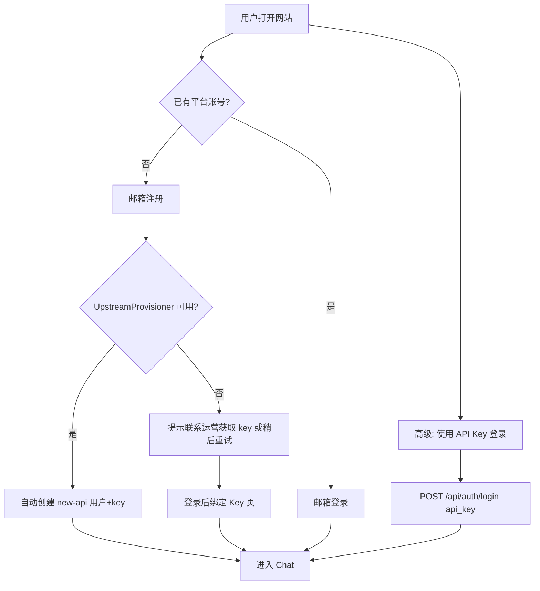

# AI Agent 多用户平台 — 实施 TODO 清单

> 基于 [AI SaaS Platform Plan](.cursor/plans/ai_saas_platform_plan_d3c7e048.plan.md) 拆解。
>
> **架构决策**：FastAPI 控制面（sidecar）+ 现有 `web_chat` Agent Gateway + Hermes 核心零业务耦合（仅保留具名、向后兼容的小补丁）。
>
> **计费**：LLM 调用继续委托 **new-api**；平台注册时自动为用户 provisioning upstream API key。
>
> **规模目标**：50 用户；PostgreSQL + pgvector + MinIO 单机部署。

**执行状态（2026-07-16）**：Phase 0–5 **MVP 主链路与产品化 Web UI 已落地**；Phase 6 仍以文档和基础验证为主，压测、正式安全 review 与生产自动化待补。控制面包名为 **`platform_api/`**（下划线，可 `import`），非计划书中的 `platform-api/`。`startplatform.sh` 默认启用 SQLite 控制面，也可用 `--postgres` 切换 PostgreSQL；未启动 Platform API 时仍可回退 legacy key-only 模式。

| Phase | 状态 | 说明 |
|-------|------|------|
| 0 基础设施 | **~90%** | Compose/nginx/Alembic/ORM 已有；Redis Worker 空壳、pgvector 索引、深度 healthz 未做 |
| 1 身份鉴权 | **~95%** | 注册/登录/bind-key/资料编辑/改密/双路径认证与 chat E2E 已有；速率限制待补 |
| 2 隔离加固 | **~95%** | UUID 贯穿 + 隔离 E2E；UUID 并发 ContextVar + Legacy→UUID 知识库越权已补测 |
| 3 文件 RAG | **~85%** | 同步 ingestion、关键词检索、文件夹/分类/标签、内容预览与 `web_knowledge_search` 已有；MinIO/Redis Worker/pgvector 待补 |
| 4 Memory/Skill | **~98%** | API + UI + catalog install/预览/CRUD + `web_skill_edit/patch`；`platform_settings` 运营配置待补 |
| 5 Admin | **~95%** | 用户分页/email 过滤、审计只读 API+UI（`#/admin/audit`）；全局 Skill UI 仍待 |
| 6 硬化上线 | **~70%** | DEPLOY、备份、update-platform、登录限流、HTTPS Cookie 验收脚本已有；压测与正式安全 review 待补 |

**最近验证（2026-07-16）**：Platform **57 cases**、Gateway/SessionDB **291 cases**、Web Chat **164 cases** 全部通过；TypeScript typecheck 与 production build 通过。

**关键产物**

| 类别 | 路径 |
|------|------|
| 控制面 API | `platform_api/`、`hermes-platform-api` |
| 持久化 | `gateway/web/platform/`（`PlatformStore`） |
| 部署 | `deploy/docker-compose.yml`、`deploy/nginx.conf` |
| 前端 | `web-chat/src/platformClient.ts`、`AuthPage`、`FilesPage`、`MemoryPage`、`SkillsPage`、`AdminPage` |
| Agent 工具 | `gateway/web/tools/sandboxed_knowledge_search.py` |
| 测试 | `tests/platform/` |
| 文档 | `docs/user-guide/platform-saas.md`、`deploy/README.md` |
| 运维脚本 | `scripts/create_admin.py` |

**下一步优先（未做项）**

1. ~~登录速率限制（Redis 计数器）~~ → **已做**：进程内滑动窗口（`platform_api/services/rate_limit.py`）；多机再接 Redis  
2. Redis 异步 Ingestion Worker + MinIO 对象存储接入  
3. pgvector cosine 检索（替换关键词 MVP）  
4. ~~备份脚本、`update-web.sh` 扩展 platform-api~~ → `scripts/backup-platform.sh` + `deploy/update-platform.sh`；**50 用户压测仍待做**  
5. ~~`web-chat` ChatPage 集成测试（mock API）~~ → `ChatPage.test.tsx` + CI `web-chat-verify.yml`
6. **web-chat UX P0**：~~`pending_bind` 引导 + 对话搜索 + 移动端抽屉 + 文件进度 + Onboarding~~

**图例**：`[ ]` 待做 · `[~]` 进行中 / 部分完成 · `[x]` 完成 · `[-]` 明确不做（MVP 外）

---

## 认证策略：双路径 + 混合 Fallback

MVP 采用 **主路径 + 备用路径**，不二选一硬切。

| 路径 | 适用场景 | 用户操作 | user_id 来源 |
|------|----------|----------|--------------|
| **主路径：平台注册** | 普通终端用户（产品目标） | 邮箱注册 / 登录 | 平台 UUID |
| **备用路径：Legacy Key** | 内测、运维、new-api Admin API 不可用 | 粘贴 `sk-...`（现有 `KeyPromptModal`） | UUID（绑定后）或 legacy 哈希 |
| **混合 Fallback** | Admin API 故障或运营手动开户 | 运营在 new-api 发 key → 用户注册后「绑定 Key」 | 平台 UUID（key 可轮换） |

**原则**

- 主登录 UI 是 `AuthPage`（注册/登录），**不删除** `KeyPromptModal` 与 `POST /api/auth/login {api_key}`
- Legacy key 登录在 UI 上降级为「高级 / 运维入口」，默认折叠
- 平台 UUID 一旦建立，upstream key 仅作 LLM 路由凭证，**换 key 不丢工作区数据**
- `UpstreamProvisioner` 失败时注册流可降级为「创建账号 + 待绑定 key」状态，不阻断注册

---

## 设计约束（全程遵守）

- [x] Hermes 核心零业务耦合：`cli.py`、`memory_manager.py`、`hermes_cli/main.py` 保持不动；`run_agent.py` 仅保留具名的 `user_id` 传播补丁
- [x] 平台业务代码落在 `platform_api/`（新建）和 `gateway/web/`（扩展）；废弃的 `platform-api/` 已删除
- [x] 用户永远不接触 shell / Docker / 配置文件
- [x] `hermes-web-chat` 工具集继续排除 `terminal`、`browser_*`、`code_execution`、`delegate_task`
- [x] 新工具采用 **wrapper 模式**（`gateway/web/tools/sandboxed_knowledge_search.py` 等）
- [x] 所有 per-user 操作在 `enter_user_context(user_id)` 内执行

---

## 已有能力（无需重做，仅需接入新身份体系）

- [x] SSE 流式对话（`gateway/platforms/web_chat.py`）
- [x] 多租户文件沙箱（`web_file_*` + `confine_path`）
- [x] 每用户 Skill 隔离（`web_skill_*`）
- [x] Web Search / Web Extract（`ddgs` + `http-fetch`，零 key）
- [x] Memory 工具（`HERMES_HOME` ContextVar 隔离）
- [x] 会话历史 CRUD + pin/archive
- [x] 聊天附件上传（`<workspace>/uploads/`）
- [x] 并发 ContextVar 隔离测试（`test_concurrent_requests_dont_swap_user_contexts`）

---

## Phase 0 — 基础设施（预估 1.5 周）✅ 骨架完成

### 0.1 目录与脚手架

- [x] 新建 `platform_api/` 项目结构（**实际包名**，非 `platform-api/`）
  - [x] `platform_api/main.py` — FastAPI 入口 + `hermes-platform-api` CLI
  - [x] `platform_api/config.py` — 环境变量 / 设置
  - [x] `gateway/web/platform/models.py` + `database.py` — SQLAlchemy ORM + session
  - [x] `platform_api/routers/` — auth、workspaces、files、memory、skills、admin、health
  - [x] `platform_api/services/` — chunking、extract、ingest、knowledge
  - [x] `platform_api/migrations/` + 根目录 `alembic.ini` — 初始迁移（`001_initial`）
  - [x] `pyproject.toml` `[platform]` extra（依赖 pin 与主 repo 一致）
- [ ] 新建 `platform_api/worker/` — Ingestion Worker 骨架（**未做**，当前为 API 内同步 ingest）
- [x] 新建 `deploy/docker-compose.yml`
- [x] 新建 `deploy/nginx.conf` — 路由规则
- [x] 新建 `deploy/.env.example` — 平台层环境变量模板

### 0.2 Docker Compose 服务

- [x] PostgreSQL 16 + **pgvector** 扩展（Compose 镜像已配置）
- [x] Redis（Compose 已配置；**业务未接入**）
- [x] MinIO（Compose 已配置；**业务未接入**，MVP 文件落盘 workspace）
- [x] nginx 反向代理
  - [x] `/api/v1/*` → Platform API（`:8700`）
  - [x] `/api/chat`、`/api/conversations*`、`/api/uploads` → Agent Gateway（`:8643`）
  - [x] `/` → SPA 静态资源
- [x] 本地一键启动文档（`deploy/README.md`）

### 0.3 数据库 Schema（Alembic 初始迁移）

- [x] `tenants` 表
- [x] `users` 表（含 `upstream_user_id`、`upstream_api_key_enc`）
- [x] `workspaces` 表
- [x] `platform_sessions` 表（统一鉴权）
- [x] `files` 表
- [~] `document_chunks` 表 — ORM 已有；**pgvector `ivfflat` 索引未建**（MVP 用 `embedding_json` + 关键词检索）
- [x] `skill_entitlements` 表
- [x] `conversation_flags` 表（`PlatformStore` 实现，启用 PG 时写入）
- [x] `audit_logs` 表
- [x] 所有业务表预留 `tenant_id` 列

### 0.4 Platform API 健康检查

- [~] `GET /api/v1/healthz` — 基础存活（**未探测** DB / Redis / MinIO）
- [x] OpenAPI 文档可访问（FastAPI 默认 `/docs`）
- [ ] 结构化日志（request_id、user_id）

### 0.5 共享库抽象

- [~] 定义 `UserStoreProtocol`（**未正式抽象**；通过 `create_user_store()` 工厂切换）
- [x] 实现 `PlatformStore`（`gateway/web/platform/store.py`，兼容 `UserStore` session/flags API）
- [x] 复用 `KeyVault`（`gateway/web/key_storage.py`）
- [x] 定义 `UpstreamProvisioner`（`gateway/web/platform/provisioner.py`）

---

## Phase 1 — 身份与鉴权（预估 2 周）✅ 主路径可用

### 1.1 new-api 集成

- [~] 调研并文档化 new-api Admin API（`AutoProvisioner` 已实现，**无独立运维文档**）
- [x] 实现 `UpstreamProvisioner` 抽象接口
  - [x] `provision(email)` → `{upstream_user_id, api_key}`（`AutoProvisioner`）
  - [ ] `revoke_user(upstream_user_id)`
  - [x] `validate_key` — `validate_key_against_upstream_sync`（bind-key / legacy 复用）
- [x] 实现 `AutoProvisioner`（调 new-api Admin API）
- [x] 实现 `ManualProvisioner`（返回 manual，不阻断注册）
- [~] 注册失败回滚逻辑 — **降级为 `pending_bind`**，非上游删除回滚
- [x] Mock / stub 层（测试 monkeypatch `validate_key_against_upstream_sync`）
- [x] 环境变量：`NEW_API_BASE_URL`、`NEW_API_ADMIN_TOKEN`、`UPSTREAM_PROVISIONER=auto|manual`

### 1.2 注册 / 登录 API

- [x] `POST /api/v1/auth/register` — `{email, password}`
  - [x] 创建 `tenant`（MVP 1:1）
  - [x] 创建 `user`（argon2 密码哈希）
  - [x] 调用 `UpstreamProvisioner`（失败时 `upstream_status=pending_bind`）
  - [x] 加密存储 `upstream_api_key_enc`（可为空）
  - [x] 创建 default `workspace`
  - [x] 初始化 `web_workspaces/<user_id>/` 目录结构
- [x] `POST /api/v1/auth/login` — 签发 `hermes_session` Cookie
- [x] `POST /api/v1/auth/logout` — 吊销 session
- [x] `GET  /api/v1/auth/me` — 返回 user + `upstream_status`
- [x] `POST /api/v1/auth/bind-key` — `{api_key}` 绑定 upstream key
- [x] `POST /api/v1/auth/forgot-password` / `reset-password` — 邮件重置（防枚举 + 单次 token）
- [x] **保留** `POST /api/auth/login` — `{api_key}` Legacy 路径（`web_chat`）
  - [~] 若 key 未关联平台账号：legacy `upsert_user` 路径（**无「创建账号并绑定」向导**）
  - [x] 已关联 / 平台用户：共享 `platform_sessions` + UUID `user_id`
- [x] 密码强度校验 + 邮箱格式校验（Pydantic `min_length=8`、`EmailStr`）
- [x] 登录失败速率限制（进程内滑动窗口；`PLATFORM_LOGIN_MAX_FAILURES` / `PLATFORM_LOGIN_WINDOW_SECONDS`）
- [x] 忘记密码自助（邮件流；见 Post-MVP Q2 / `test_auth_password_reset.py`）
- [ ] `[-]` MVP 不做：注册邮件验证

### 1.3 统一 Session（双服务共用）

- [x] `platform_sessions` 写入 / 读取 / 过期清理（`PlatformStore`）
- [x] Cookie 配置：`HttpOnly`、`SameSite=Lax`、`Secure`（可配置）
- [x] `gateway/web/user_store_factory.py` — `PLATFORM_DATABASE_URL` 时切换 `PlatformStore`
- [x] `gateway/platforms/web_chat.py` — `create_user_store()`；`/api/me` 含 `email`、`upstream_status`
- [x] Chat 请求：`pending_bind` 且无 key 时 403；有 key 时 `enter_upstream_key()`
- [x] 集成测试：Platform 登录 → bind-key → Cookie → `POST /api/chat` SSE（`tests/platform/test_chat_e2e.py`）

### 1.4 前端 Auth 改造

- [x] 新增 `web-chat/src/pages/AuthPage.tsx`（注册 + 登录）
- [~] `web-chat/src/api.ts` 拆分 — 新增 `platformClient.ts`；`api.ts` 仍服务 Agent Gateway
- [~] 路由：未登录显示 `AuthPage`；**无独立 `#/auth` hash**（App 级门禁）
- [x] `AuthPage` 主路径；`KeyPromptModal` 保留为「API Key 登录」
- [x] Settings 内 bind-key 区块（`upstream_status=pending_bind`）
- [x] Chat 页：`pending_bind` 无 key 时服务端 403（Settings 引导绑定）
- [x] i18n 文案（`zh.json` / `en.json`）
- [~] 401 统一跳转 — App 级 `tryPlatformSession`；**非全局 axios 拦截器**

### 1.5 Workspace API

- [x] `GET /api/v1/workspaces` — 返回用户 workspace 列表
- [x] `GET /api/v1/workspaces/{id}` — owner 校验

---

## Phase 2 — 多租户隔离加固（预估 1 周）~ 基础完成

### 2.1 user_id 体系迁移

- [x] `platform_user_id`（UUID）贯穿：
  - [x] `enter_user_context(user_id)`
  - [x] `WebChatAgentRunner` → `AIAgent(user_id=...)`
  - [x] `sessions.user_id` 写入（上游 patch，已有）
  - [x] `list_sessions_rich` / `search_messages` 过滤
- [x] `derive_user_id(api_key)` 保留用于 **Legacy 纯 key 会话**
- [ ] Legacy → 平台账号迁移：`legacy_user_id_map`（**未实现**）
- [x] `conversation_flags` — `PlatformStore` 写入 PG（启用 `PLATFORM_DATABASE_URL` 时）

### 2.2 权限中间件

- [x] Platform API：Cookie session → `get_current_user_id` / `require_admin`
- [x] DB 查询按 `owner_id` / `workspace_id` / `tenant_id` 过滤
- [x] Admin 路由 `role=admin` 门禁
- [x] Agent Gateway：会话归属校验（非属主 → 404，已有）

### 2.3 隔离测试

- [x] `tests/platform/test_isolation.py` — UUID 工作区路径隔离 + session cookie 共享
- [x] `tests/platform/test_isolation_extended.py` — 跨用户会话（读/改/删/列表）、记忆（读/写）、知识库（搜索/列表/删除）、禁用用户
- [x] `test_concurrent_requests_dont_swap_user_contexts`（UUID 身份，`test_web_sandbox.py`）
- [x] 用户 A 无法 `GET /api/conversations/{B_session_id}`
- [x] 用户 A 无法读用户 B 的 memory（Platform API）
- [x] 用户 A 无法检索用户 B 的 `document_chunks`
- [x] 禁用用户无法登录和 chat
- [x] Legacy key 不能访问其他 UUID 用户知识库（`test_legacy_key_cannot_search_uuid_users_knowledge`）
- [ ] bind-key 后会话统一

### 2.4 文档

- [~] 更新 `docs/user-guide/web-chat.md` — **未改**；新增 `docs/user-guide/platform-saas.md`
- [x] 更新 `README.zh-CN.md`，对齐 Platform SaaS 主路径、当前功能与测试状态

---

## Phase 3 — 文件与 RAG（预估 3 周）~ MVP 同步路径可用

### 3.1 对象存储

- [ ] MinIO bucket 初始化（Compose 有服务，**业务未接**）
- [ ] S3 客户端封装（`boto3`）
- [~] 存储 key 规范 — 当前为 `<workspace>/uploads/{file_id}_{name}` 本地路径

### 3.2 文件上传 API

- [x] `POST /api/v1/workspaces/{id}/files` — multipart 上传
  - [x] 格式白名单：PDF、DOCX、XLSX、PPTX、**TXT、MD**
  - [x] 单文件 ≤ 20MB
  - [x] 写入 workspace + `files` 表（`status=pending` → ingest 后 `ready`）
  - [ ] 推送 Redis ingestion 任务（**当前 API 内同步 ingest**）
- [x] `GET  /api/v1/workspaces/{id}/files` — 列表 + 状态
- [x] `GET  /api/v1/workspaces/{id}/files/{file_id}/status` — 状态
- [x] `DELETE /api/v1/workspaces/{id}/files/{file_id}` — 删文件 + chunks + 元数据

### 3.3 Ingestion Worker

- [~] **同步** ingestion（`platform_api/services/ingest.py`），非 Redis Worker
- [x] 解析器：PDF / DOCX / XLSX / PPTX / TXT / MD
- [x] Chunk 切分（`chunking.py`，1200 字符 + overlap）
- [~] Embedding — 可选 OpenAI-compatible API；**离线回退伪向量 + 关键词检索**
- [~] 写入 `document_chunks`（**无 pgvector 列**，SQLite 用 `embedding_json`）
- [x] 状态机：`pending` → `ready` | `failed`
- [ ] 失败重试 + 死信队列
- [ ] `[-]` MVP 不做：OCR

### 3.4 知识库检索

- [x] `POST /api/v1/workspaces/{id}/knowledge/search`
- [x] `search_knowledge()` — 关键词 token 重叠（**非 pgvector cosine**）
- [x] 结果含 chunk 文本、文件名、分数

### 3.5 Agent 工具 `web_knowledge_search`

- [x] `gateway/web/tools/sandboxed_knowledge_search.py`
- [x] 调用 `search_knowledge()`（同进程，非 HTTP）
- [x] `workspace_id` 来自当前 `enter_user_context`
- [x] 注册到 `hermes-web-chat` toolset
- [x] `tests/platform/test_knowledge.py`

### 3.6 前端文件管理 UI

- [x] `web-chat/src/pages/FilesPage.tsx`
- [x] 上传进度 + 列表 + 重命名/移动/删除（拖拽上传仍待补）
- [x] 路由 `#/files` + 导航入口
- [x] Chat 页保留 `/api/uploads` 快速附件路径
- [x] 创建时间列；文件夹与文件同列表；标签管理独立页 `#/file-tags`
- [x] Tabs：全部 / 文件 / 图片；新建下拉（文件夹、上传、上传并检索）
- [x] 后端 `file_folders` + `files.folder_id` + `kind=image|document`

---

## Phase 4 — Memory 与 Skill UI（预估 1.5 周）✅ 基本完成

### 4.1 Memory API

- [x] `GET  /api/v1/workspaces/{id}/memory` — `MEMORY.md` + `USER.md`
- [x] `PATCH /api/v1/workspaces/{id}/memory` — `{long_term?, profile?}`
- [x] `enter_user_context(user_id)` 内读写
- [x] 文件不存在返回空字符串

### 4.2 Memory UI

- [x] `web-chat/src/pages/MemoryPage.tsx`
- [x] 长期记忆 / 用户画像编辑区 + 保存（已升级为 Memory Center）
- [~] 重置 / 字符计数（**未做**）
- [x] 路由 `#/memory`

### 4.2b Memory Center MVP

- [x] `memory_items` 表 + Alembic `002_memory_items`
- [x] `platform_api/services/memory_center.py` — CRUD / approve / reject / 投影 md
- [x] API：`/memory/items`、`/memory/stats`、approve、reject、migrate-from-files
- [x] Memory Center UI：Profile / Preferences / Projects / Pending / All
- [x] `web_memory` 工具替换 hermes-web-chat 的 `memory`（仅 pending）
- [x] Extractor stub + `PLATFORM_MEMORY_EXTRACTOR` feature flag（默认关）
- [ ] 聊天后 LLM Memory Extractor（pending only）— Phase 2

### 4.3 Skill 配置 API

- [x] `GET  /api/v1/workspaces/{id}/skills` — 全局 + 用户 + entitlement
- [x] `GET  /api/v1/workspaces/{id}/skills/{name}` — 预览 SKILL.md（user overlay）
- [x] `POST /api/v1/workspaces/{id}/skills/install-from-catalog` — 全局库复制到 workspace
- [x] `PATCH /api/v1/workspaces/{id}/skills/{name}` — `{enabled, config?}`
- [x] 读全局库 `$HERMES_HOME/skills/`
- [x] 读用户库 `<workspace>/skills/`
- [x] Agent：`web_skill_edit` / `web_skill_patch`（全局 fork-on-write）

### 4.4 Skill UI

- [x] `web-chat/src/pages/SkillsPage.tsx`
- [x] 列表 + 启用开关
- [x] SKILL.md 侧栏预览
- [x] 路由 `#/skills`

### 4.5 Agent 启动时 Skill Hint 注入

- [x] `web_chat.py::_build_skill_hint()` 读取 enabled skills
- [x] 附加 ephemeral `system_prompt` 片段
- [x] 未修改 `prompt_builder.py`
- [ ] 测试：启用 skill 后 agent 主动调用 `web_skills_list`

### 4.6 Web Search（P1，已有能力，仅补运营配置）

- [x] `web_search` / `web_extract` 在 `hermes-web-chat` 中默认可用
- [ ] Admin `platform_settings` 热切换 backend
- [~] 文档：`platform-saas.md` 提及；**无独立运营切换指南**

---

## Phase 5 — 管理后台（预估 1 周）✅ 基础可用

### 5.1 Admin API

- [x] `GET  /api/v1/admin/users` — 分页 `{users,total,limit,offset}` + `email` 过滤
- [x] `PATCH /api/v1/admin/users/{id}` — `{status: active|disabled}`
- [x] `GET  /api/v1/admin/stats` — 用户数、文件数、chunk 数
- [x] `GET  /api/v1/admin/skills` — 全局 skill 只读列表
- [x] `GET  /api/v1/admin/audit` — 审计日志分页只读
- [x] admin 操作写 `audit_logs`

### 5.2 Admin UI

- [x] `web-chat/src/pages/AdminPage.tsx`（`role=admin` 导航门禁）
- [x] 用户表格 + 禁用/启用 + email 搜索 + 分页
- [x] 基础统计
- [x] `#/admin/audit` 审计只读页（`AdminAuditPage`）
- [~] 全局 Skill 浏览（API 有，**UI 未单独展示 skill 列表**）
- [x] 路由 `#/admin` / `#/admin/audit`

### 5.3 种子数据

- [x] `scripts/create_admin.py`（**非** `platform-api/scripts/`）
- [x] `deploy/README.md` + `docs/user-guide/platform-saas.md` 含 admin 初始化说明

---

## Phase 6 — 硬化与上线（预估 1 周）~ 文档先行

### 6.1 安全

- [~] 安全 review — 基础实践已遵循（HttpOnly cookie、sandbox、KeyVault）；**无正式 checklist 签署**
- [~] 密钥轮换文档 — `platform-saas.md` 提及 `HERMES_WEB_KEY_VAULT_SECRET`
- [ ] 依赖审计（`uv lock` / supply-chain）
- [x] HTTPS + `PLATFORM_COOKIE_SECURE=true` 生产验证 — `scripts/verify-https-cookies.sh` + `test_cookie_secure.py` + DEPLOY §9
- [ ] 非 loopback 绑定测试

### 6.2 可靠性

- [x] PostgreSQL / `web_workspaces` / `state.db` / key vault 备份 — `scripts/backup-platform.sh` + DEPLOY §12
- [~] 健康检查 — 双服务 `/healthz` 存活探测（**无聚合面板**）
- [ ] 优雅停机（gateway drain）

### 6.3 性能

- [ ] 压测：50 并发用户（locust / k6）
- [ ] 监控 SQLite WAL 延迟
- [ ] pgvector 检索基准（1 万 chunk）

### 6.4 文档与部署

- [x] `docs/user-guide/platform-saas.md`
- [x] `deploy/update-platform.sh`（双服务更新；legacy 仍用 `update-web.sh`）
- [x] `docs/user-guide/DEPLOY.md` 生产部署 / 更新 / 备份
- [~] 生产 checklist — 见 `deploy/README.md` + `platform-saas.md` + `DEPLOY.md`
- [x] 更新 `README.zh-CN.md`

### 6.5 CI

- [x] `tests/platform/` 纳入 `scripts/run_tests.sh`
- [ ] Docker Compose 集成测试 job（GitHub Actions）

---

## MVP 功能验收清单

### 用户侧

- [x] 邮箱注册
- [x] 邮箱登录 / 登出
- [x] 自动创建 default Workspace
- [x] Chat 页面（SSE 流式 + 工具事件）
- [x] 对话新建 / 切换 / 历史加载 / 重命名 / 删除 / 置顶 / 归档

### 文件与知识库

- [x] 上传 PDF / Word / Excel / PPT（+ TXT / MD）
- [~] 解析进度展示（~~无实时进度 UI~~ → Files 页轮询 status + 状态徽章）
- [x] 「我的文件」列表与删除
- [x] Agent 通过 `web_knowledge_search` 检索个人知识库

### Agent 能力

- [~] Hermes 对话（需 bind-key 或 AutoProvisioner 成功；`pending_bind` 时 chat 403）
- [x] Memory 读取与 Web 编辑
- [x] Skill 启用/禁用与查看
- [x] Web Search / Web Extract

### 管理

- [x] Admin 用户列表与禁用/启用
- [~] Admin 全局 Skill 库浏览（API 有，UI 简版）
- [x] Admin 存储用量概览（stats：users/files/chunks）

---

## web-chat SPA — 用户体验待办（按人气 × 实用度）

> **现状快照（2026-07-16）**：Chat 核心链路与 Platform 工作台已经进入可用状态。现有 UI 覆盖 Auth、Chat、Settings、Files/Tags、Memory、Skills、Admin，并完成响应式导航、Onboarding、会话搜索、主题/字号、模型选择、附件与文件预览、文件标签管理、用量展示等产品化体验。剩余工作主要是基础设施异步化、检索质量、Admin 深化和上线硬化。

**排序说明**：P0 = 多数用户每天都会碰到且明显影响留存；P1 = ChatGPT 类产品的常见预期；P2 = 提升专业用户/运营效率；P3 = 锦上添花。与 § MVP 明确不做 冲突的项（PWA、OAuth、多 Workspace UI）不列入。

### P0 — 高人气 × 高实用（建议下一迭代）

| 优先级 | 功能 | 用户痛点 | 现状 / 缺口 |
|--------|------|----------|-------------|
| ★★★ | **`pending_bind` 全局引导** | 注册后发消息遇 403，不知要去设置页绑 key | 仅 Settings 有 bind 表单；Chat 无顶栏警告 |
| ★★★ | **移动端会话侧栏** | ≤720px 侧栏 `display:none`，无法切换/新建对话 | `styles.css` 隐藏 `.chat-side` 且无抽屉按钮 |
| ★★★ | **对话列表搜索** | 会话多了找不到历史 | 无标题/预览过滤 |
| ★★☆ | **知识库解析进度 UI** | 上传后不知是否在索引 | API 有 `status`；Files 页只显示静态文案 |
| ★★☆ | **注册后 Onboarding** | 新用户不知道下一步（绑 key → 首条消息） | 注册成功直接进 Chat，无分步引导 |

- [x] Chat / App 顶栏：`upstream_status=pending_bind` 时展示可点击的绑定引导（跳转 Settings）
- [x] 移动端：汉堡菜单 + 会话抽屉（新建 / 切换 / 归档入口）
- [x] `ConversationList`：按标题/预览实时筛选
- [x] `FilesPage`：轮询 `GET .../files/{id}/status`，展示 processing / ready / failed + 错误信息
- [x] 首次登录向导（3 步：绑 key → 可选上传文件 → 发送首条消息）

### P1 — 高人气 × 中等实用

| 优先级 | 功能 | 说明 |
|--------|------|------|
| ★★★ | ~~**Markdown 代码块高亮 + 复制**~~ | `MarkdownContent` + hljs + 「复制代码」 |
| ★★☆ | ~~**导出当前对话**~~ | 标题菜单：分享 / 导出 Markdown（已完成） |
| ★★☆ | ~~**用量 / 配额展示**~~ | Settings → API 密钥：new-api `usage` + logs（已完成） |
| ★★☆ | ~~**Composer 拖拽/粘贴上传**~~ | Composer：`onDrop` / `onPaste` → 现有 `uploads.create` |
| ★★☆ | ~~**手动深色/浅色主题**~~ | Account 下拉与 Settings 均支持 system / light / dark |
| ★★☆ | **修改密码** | Auth 仅注册/登录；需 platform API + Settings UI |
| ★☆☆ | ~~**模型选择器**~~ | Composer 已提供可搜索模型下拉，并支持常用模型筛选 |

- [x] `MarkdownContent`：代码块 `hljs` 或轻量高亮 + 「复制代码」按钮
- [x] Chat 菜单：「导出对话」→ `.md` 下载或剪贴板 / 系统分享
- [x] `ChatPage` composer：`onDrop` / `onPaste` 走现有 `uploads.create` 流程
- [x] Settings：主题 `system | light | dark`（`localStorage` + `.light` / `.dark`）
- [x] `POST /api/v1/auth/change-password` + Settings 表单
- [x] Settings：模型偏好（常用模型筛选）
- [x] Composer：可搜索模型下拉 + workspace 偏好

### P2 — 中等人气 × 提升专业度

| 优先级 | 功能 | 说明 |
|--------|------|------|
| ★★☆ | ~~**用量 / 配额展示**~~ | 已迁至 P1「API 密钥」Tab（`/api/v1/billing/*`） |
| ★★☆ | ~~**知识库试搜索**~~ | 文件页「试搜」对话框调用 `knowledge/search` |
| ★★☆ | **Skill 详情预览** | 仅开关列表；无法浏览 SKILL 摘要/说明 |
| ★★☆ | ~~**Admin 分页 + 用户搜索**~~ | `AdminPage` + `GET /admin/users?limit&offset&email` |
| ★☆☆ | ~~**Admin 审计日志 UI**~~ | `#/admin/audit` + `GET /admin/audit` |
| ★☆☆ | **Admin 全局 Skill 浏览** | API `GET /admin/skills` 已有；UI 未展示 |

- [x] Settings：用量卡片（余额 / 日志，代理 new-api）
- [x] `FilesPage` 或独立面板：输入 query → 展示 chunk 命中与来源文件名
- [x] 文件列表：客户端分页（25/页）+ 名称搜索 + 工具条收拢
- [x] App：顶栏固定，主内容区独立滚动
- [x] `SkillsPage`：技能库分区 + 安装到 workspace + 侧栏预览 SKILL.md
- [ ] Admin：全局 Skill 浏览（可与 Skills catalog 共用扫描逻辑）
- [x] `AdminPage`：email 过滤、分页控件；后端 `limit/offset/email`
- [x] `AdminPage`：`#/admin/audit` 只读表格（时间、操作、目标）
- [ ] `AdminPage`：全局 Skill 只读列表（调用 `platform.adminSkills()`）

### P3 — 体验抛光

- [x] 全局 Sonner Toast 基础设施与关键操作非阻塞提示
- [ ] `MemoryPage`：Markdown 预览分栏（编辑 | 预览）
- [~] `FilesPage`：已有上传百分比进度；拖拽上传区待补
- [x] 键盘快捷键面板（`?`）：发送、新建对话、聚焦输入框
- [ ] 账户：修改邮箱、注销账号（需 API + 合规文案）
- [x] 无障碍：焦点陷阱、跳过导航、`aria-live` 流式区域
- [x] 更新 `web-chat/README.md`（移除不存在的 `QuotaBadge` 描述，对齐实际页面树）

### 已有能力（无需重复立项）

- [x] SSE 流式、停止生成、token 用量展示
- [x] 消息复制 / 重试 / 编辑
- [x] 工具事件折叠、`image_generate` 缩略图
- [x] 推理过程 `ReasoningPanel`、活动日志 `ActivityLog`
- [x] 斜杠命令补全、会话置顶/归档/重命名/删除
- [x] 中英双语 `LanguageToggle`
- [x] Platform 六路由 + Legacy Key 备路径
- [x] Account 下拉主题/字号快捷设置，Settings 完整偏好设置
- [x] 文件夹、分类、标签、内容预览与「引用到对话」

---

## MVP 明确不做

- [-] OAuth / SSO / 企业组织多租户
- [-] 付费订阅 / Stripe
- [-] 每用户多 Workspace
- [-] 实时多设备推送同步（SSE event-bus）
- [-] OS 级 Docker 沙箱 / terminal / browser 工具
- [-] `delegate_task` 多 Agent 编排
- [-] OCR 扫描版 PDF
- [-] 独立向量数据库（Qdrant / Milvus）
- [-] 移动端 App / PWA
- [-] 用户自带 API Key 作为**唯一**身份入口（MVP 保留为备用路径，非主路径）
- [ ] Post-MVP：BYOK 与平台账号并存（Q3 路线图）
- [-] 修改 Hermes 核心代码
- [-] PostgreSQL RLS（MVP 用应用层 RBAC；Post-MVP 再加）

---

## Post-MVP 路线图

### Q2 — 增长

- [ ] OAuth / SSO（代理层）
- [ ] 每用户多 Workspace / 团队空间
- [ ] Hermes `state.db` 迁 PostgreSQL
- [ ] 推送式多浏览器同步（per-user SSE event-bus）
- [x] 忘记密码邮件流（`POST /auth/forgot-password` + `/auth/reset-password` + AuthPage）

### Q3 — 平台化

- [ ] Agent Profiles（Coding / Research / Trading / Personal Assistant）
- [ ] BYOK（用户绑定自己的 API Key）
- [ ] Stripe 计费集成
- [ ] Skill 插件市场
- [ ] `platform_settings` 热切换搜索供应商 Admin UI

### Q4 — 基础设施

- [ ] Kubernetes Helm Chart
- [ ] PostgreSQL Row Level Security
- [ ] OS 级 per-user 沙箱（Docker terminal backend）
- [ ] 上游 `register_gateway_platform()` plugin hook 提案

### 上游回馈

- [ ] `user_id` 传播 fix PR → `NousResearch/hermes-agent`
- [ ] `web_search` / `web_extract` 按 capability 门控 fix PR

---

## API 端点总表

### Platform API (`/api/v1/`)

| 方法 | 路径 | Phase | 状态 |
|------|------|-------|------|
| GET | `/healthz` | 0 | [~] 存活 only |
| POST | `/auth/register` | 1 | [x] |
| POST | `/auth/login` | 1 | [x] |
| POST | `/auth/logout` | 1 | [x] |
| POST | `/auth/bind-key` | 1 | [x] |
| GET | `/auth/me` | 1 | [x] |
| PATCH | `/auth/me` | 1 | [x] 资料 / 头像 |
| POST | `/auth/change-password` | 1 | [x] |
| POST | `/auth/forgot-password` | 1 | [x] |
| POST | `/auth/reset-password` | 1 | [x] |
| GET | `/billing/usage`、`/billing/logs` | 1 | [x] |
| GET | `/workspaces` | 1 | [x] |
| GET | `/workspaces/{id}` | 1 | [x] |
| GET | `/workspaces/{id}/models` | 1 | [x] |
| GET/PATCH | `/workspaces/{id}/preferences` | 1 | [x] |
| POST | `/workspaces/{id}/files` | 3 | [x] |
| GET | `/workspaces/{id}/files` | 3 | [x] |
| PATCH | `/workspaces/{id}/files/{file_id}` | 3 | [x] 重命名 / 移动 / 标签 |
| DELETE | `/workspaces/{id}/files/{file_id}` | 3 | [x] |
| GET | `/workspaces/{id}/files/{file_id}/content` | 3 | [x] 预览 / 下载 |
| POST | `/workspaces/{id}/files/{file_id}/ingest` | 3 | [x] |
| GET | `/workspaces/{id}/files/{file_id}/status` | 3 | [x] |
| CRUD | `/workspaces/{id}/file-folders*` | 3 | [x] |
| CRUD | `/workspaces/{id}/file-categories*` | 3 | [x] |
| CRUD | `/workspaces/{id}/file-tags*` | 3 | [x] |
| POST | `/workspaces/{id}/knowledge/search` | 3 | [x] |
| GET | `/workspaces/{id}/memory` | 4 | [x] |
| PATCH | `/workspaces/{id}/memory` | 4 | [x] |
| GET | `/workspaces/{id}/skills` | 4 | [x] |
| GET | `/workspaces/{id}/skills/{name}` | 4 | [x] |
| POST | `/workspaces/{id}/skills/install-from-catalog` | 4 | [x] |
| POST | `/workspaces/{id}/skills` | 4 | [x] |
| PATCH | `/workspaces/{id}/skills/{name}` | 4 | [x] |
| DELETE | `/workspaces/{id}/skills/{name}` | 4 | [x] |
| GET | `/admin/users` | 5 | [x] |
| PATCH | `/admin/users/{id}` | 5 | [x] |
| GET | `/admin/stats` | 5 | [x] |
| GET | `/admin/skills` | 5 | [x] |

### Agent Gateway (`/api/`，已有 + 改造)

| 方法 | 路径 | 状态 |
|------|------|------|
| GET | `/healthz` | [x] |
| POST | `/chat` | [x] PG session + `pending_bind` 门禁 |
| GET | `/conversations` | [x] |
| GET | `/conversations/{id}` | [x] |
| PATCH | `/conversations/{id}` | [x] |
| DELETE | `/conversations/{id}` | [x] |
| POST | `/conversations/{id}/flags` | [x] |
| POST | `/uploads` | [x] |
| GET | `/commands` | [x] |
| POST | `/command` | [x] |
| GET | `/me` | [x] 含 `email`、`upstream_status`（平台用户） |
| POST | `/auth/login` | [x] Legacy key 登录（保留） |
| POST | `/auth/logout` | [x] |

---

## 技术风险跟踪

| ID | 风险 | 缓解措施 | 状态 |
|----|------|----------|------|
| R1 | new-api Admin API 不稳定 | `ManualProvisioner` + bind-key + Legacy key | [~] 已缓解，待生产验证 |
| R9 | 双登录路径身份混乱 | UUID 主路径 + Legacy 折叠入口 | [~] 已缓解；`legacy_user_id_map` 未做 |
| R2 | 双服务鉴权不一致 | `platform_sessions` + session 单测 + **chat E2E** | [~] 已缓解 |
| R3 | user_id UUID 迁移 | 新部署无负担 | [x] |
| R4 | RAG 质量参差 | 关键词 MVP + 引用来源 | [~] |
| R5 | Embedding 成本 | 可选 API + 离线回退 | [~] |
| R6 | SQLite 并发瓶颈 | 未压测 | [ ] |
| R7 | ContextVar 跨租户泄漏 | 并发测试保留 + **隔离 E2E** | [~] 已缓解 |
| R8 | 双 API 前端路由混乱 | nginx + `platformClient.ts` + Vite 双代理 | [x] |

---

## 工作量汇总

| Phase | 内容 | 预估 |
|-------|------|------|
| 0 | 基础设施 | 1.5 周 |
| 1 | 身份与鉴权 | 2 周 |
| 2 | 隔离加固 | 1 周 |
| 3 | 文件与 RAG | 3 周 |
| 4 | Memory / Skill UI | 1.5 周 |
| 5 | Admin | 1 周 |
| 6 | 硬化上线 | 1 周 |
| **合计** | **MVP** | **~11 人周** |

---

## 变更日志

| 日期 | 变更 |
|------|------|
| 2026-07-13 | 初版：基于 AI SaaS Platform Plan 生成 |
| 2026-07-13 | 增加双路径认证：平台注册（主）+ Legacy Key（备）+ bind-key 混合 Fallback |
| 2026-07-13 | **E2E**：`test_chat_e2e.py`（register→bind→chat SSE）+ `test_isolation_extended.py`（5 cases）；platform 测试 14 cases |
| 2026-07-13 | **web-chat UX 待办**：按用户视角补充 P0–P3 功能缺口（§ web-chat SPA） |
| 2026-07-16 | 对齐当前实现：文件夹/分类/标签与预览、Skill 预览/CRUD、模型与账户偏好、用量、主题/字号及产品化 Chat UX |
| 2026-07-16 | 完整验证：Platform 57 + Gateway/SessionDB 291 + Web Chat 164 cases 全绿，typecheck/build 通过；README 中文版改为 Platform SaaS 主路径 |
